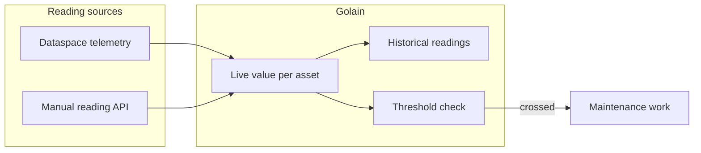

**Counters** track how much an asset has been used — running hours, cycle counts, energy consumed, downtime — so you know when it needs service. You define what a counter measures and how it updates; Golain ingests readings, keeps a live value per asset, and can trigger maintenance when a counter crosses a threshold.

Counters read from your device telemetry automatically, or you can post readings manually. Either way, the same live value and threshold logic applies.

## At a glance



## Core concepts

<CardGroup cols={2}>
  <Card title="Counter definition" icon="ruler">
    A project- or asset-type-level rule that says what a counter measures (`key`, `unit`, `kind`), where its value comes from, and how readings turn into an updated value.
  </Card>
  <Card title="Live value" icon="gauge">
    The current value for a counter on a specific asset — updated continuously as readings arrive, and readable with low latency for dashboards.
  </Card>
  <Card title="Rollup" icon="chart-line">
    How readings in a time window combine into a value: sum, max, last, avg, or min. Most usage counters use `sum`; instantaneous readings like vibration use `last` or `max`.
  </Card>
  <Card title="Thresholds" icon="triangle-exclamation">
    Levels a counter can cross (for example, 500 running hours) that trigger a maintenance action — see [Maintenance](/assets/maintenance).
  </Card>
</CardGroup>

## Counter kinds

A counter definition's `kind` determines how Golain interprets each incoming reading:

| Kind | Behavior | Example | How the value changes |
|------|----------|---------|------------------------|
| `accumulator` | Increases only; each reading contributes a delta | Running hours, cycle count | Your increment rule returns the delta to add |
| `gauge` | Can go up or down; reflects the latest sample | Temperature, vibration | Each reading replaces the current value |
| `totalizer` | An absolute cumulative meter reading, like an odometer | kWh, total flow volume | Golain computes the delta between the new reading and the previous one |

<Note>
  For a `totalizer` counter, a reading of 45 kWh followed by 46 kWh means **46 kWh total consumed**, not 91. Golain computes the 1 kWh delta from the previous reading automatically, including basic rollover handling for meters that wrap around.
</Note>

## Defining a counter

A counter definition sets:

- **`key`, `name`, `unit`** — identity and display (for example `running_hours`, "Running hours", `h`).
- **`kind`** and **`rollup`** — how readings accumulate, per the table above.
- **Scope** — a counter definition applies either to every asset of an asset type, or to one specific asset.
- **Increment rule** — a CEL expression that computes the delta (or absolute value for a totalizer) from an incoming telemetry field.
- **Reconcile rule** *(optional)* — a QueryScript that Golain runs on a schedule to recompute the counter from source data, correcting for missed readings or drift.
- **Thresholds** — values that trigger a maintenance action when crossed, with an optional severity and re-arm condition.
- **Reset policy** — when the counter is allowed to reset to zero (for example, after a maintenance job closes).

<Note>
  For roll-up values that combine multiple child assets in non-trivial ways (OEE-style availability × performance × quality, MTBF, and similar), use a **reconcile QueryScript** on the parent asset rather than changing the rollup mode per level of your asset tree. This keeps the aggregation logic in one place and lets it read from any counter or asset property it needs.
</Note>

## How readings become a value

1. A reading arrives — either from dataspace telemetry that matches a counter definition's source field, or from a manual `POST` to the reading endpoint.
2. Golain batches incoming readings for a few seconds before writing them, so a busy sensor feed doesn't hit the database on every tick. Your live value still updates on each reading; only the durable history write is batched.
3. The live value for that counter on that asset updates immediately, and becomes visible through the live counters API.
4. On a slower schedule, Golain rolls historical readings into hourly summaries for dashboards and reports.
5. If a threshold is crossed, Golain can open maintenance work automatically — see [Maintenance](/assets/maintenance) for how thresholds connect to work orders.

<Note>
  If a counter has a reconcile QueryScript configured, Golain also recomputes it periodically from source data. Treat reconcile as the authoritative value if live and reconciled values ever disagree — for example, after a period without a cache available.
</Note>

## Resetting and reconciling

Two actions apply to a counter on a specific asset:

| Action | What it does | When to use it |
|--------|--------------|-----------------|
| **Reset** | Sets the counter's value back to zero (or its configured baseline) | After a maintenance job that resets the physical meter, or a component replacement |
| **Reconcile** | Recomputes the counter's value from source data right now, instead of waiting for the next scheduled run | The live value looks wrong, or you changed the counter's increment rule and want it backfilled |

## API reference

Counter definitions live at the project level. Live values and actions are scoped to an asset.

### Counter definitions

| Method | Path | Description |
|--------|------|--------------|
| `GET` | `/projects/{project_id}/counter-defs` | List counter definitions in the project |
| `POST` | `/projects/{project_id}/counter-defs` | Create a counter definition |
| `GET` | `/projects/{project_id}/counter-defs/{counter_def_id}` | Get a counter definition |
| `PATCH` | `/projects/{project_id}/counter-defs/{counter_def_id}` | Update a counter definition |
| `DELETE` | `/projects/{project_id}/counter-defs/{counter_def_id}` | Delete a counter definition |

### Asset counters

| Method | Path | Description |
|--------|------|--------------|
| `GET` | `/projects/{project_id}/assets/{asset_id}/counters` | List live counter values for an asset |
| `POST` | `/projects/{project_id}/assets/{asset_id}/counters/reading` | Record a manual reading |
| `POST` | `/projects/{project_id}/assets/{asset_id}/counters/reset` | Reset a counter to its baseline |
| `POST` | `/projects/{project_id}/assets/{asset_id}/counters/reconcile` | Recompute a counter from source data now |

Creating, updating, deleting, resetting, and reconciling all require **`can_manage_assets`** on the project.

## Example: create a counter definition

```bash
export API=https://api.ilyama.golain.io/core/api/v1
export TOKEN=<your-oidc-access-token>
export ORG_ID=<your-org-uuid>
export PROJECT_ID=<your-project-uuid>

curl -sS -X POST \
  -H "Authorization: Bearer $TOKEN" \
  -H "ORG-ID: $ORG_ID" \
  -H "Content-Type: application/json" \
  -d '{
    "key": "running_hours",
    "name": "Running hours",
    "unit": "h",
    "kind": "accumulator",
    "rollup": "sum",
    "scope_asset_type_id": "<asset-type-uuid>",
    "source_dataspace_id": "<dataspace-uuid>",
    "source_field_path": "motor.run_seconds",
    "increment_cel": "(new.motor.run_seconds - old.motor.run_seconds) / 3600.0",
    "thresholds": [{ "at": 500, "emit": "maintenance_due", "severity": "high" }]
  }' \
  "$API/projects/$PROJECT_ID/counter-defs"
```

## Example: record a manual reading

Use this when a counter has no telemetry source, or to correct a value by hand.

```bash
export ASSET_ID=<your-asset-uuid>
export COUNTER_DEF_ID=<your-counter-def-uuid>

curl -sS -X POST \
  -H "Authorization: Bearer $TOKEN" \
  -H "ORG-ID: $ORG_ID" \
  -H "Content-Type: application/json" \
  -d "{\"counter_def_id\": \"$COUNTER_DEF_ID\", \"value\": 1204.7}" \
  "$API/projects/$PROJECT_ID/assets/$ASSET_ID/counters/reading"
```

## Example: read live values for an asset

```bash
curl -sS \
  -H "Authorization: Bearer $TOKEN" \
  -H "ORG-ID: $ORG_ID" \
  "$API/projects/$PROJECT_ID/assets/$ASSET_ID/counters"
```

```json
{
  "ok": 1,
  "data": {
    "items": [
      {
        "counter_def_id": "b7e0…",
        "key": "running_hours",
        "name": "Running hours",
        "unit": "h",
        "kind": "accumulator",
        "value": 1204.7,
        "updated_at": "2026-07-20T07:32:11.000000000Z"
      }
    ]
  }
}
```

<Note>
  **Self-hosted:** counters need **Redis** (for live values and the short-lived reading buffer) and **TimescaleDB** (for historical readings and rollups) available to your deployment. See [Self-hosted overview](/self-hosted/overview) for what to provision.
</Note>

## Related

- [Assets](/assets/overview) — asset types, hierarchy, and identity
- [Maintenance](/assets/maintenance) — how a threshold crossing opens work
- [KPIs & reporting](/assets/kpis-and-reporting) — using counters in reports and dashboards
- [Scheduler](/assets/scheduler) — recurring reconcile and inspection jobs
