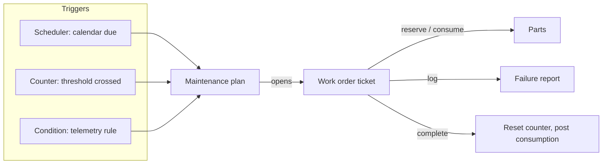

**Maintenance** turns asset conditions into action. A **maintenance plan** watches a calendar, a counter, or a telemetry condition, and opens a **work order** when it's due. A work order is a real **ticket** running on your project's maintenance workflow — the same assignment, status tracking, and forms you already use for other ticket types — plus two CMMS-specific side records: **parts** consumed and a **failure report**.

<Note>
  Maintenance is currently **API-first**. There's no dedicated console module yet for maintenance plans or work orders — use the HTTP API, or drive it from your own tooling, until a console UI ships.
</Note>

## At a glance



## Core concepts

<CardGroup cols={2}>
  <Card title="Work order = ticket" icon="ticket">
    A work order is a ticket on your project's maintenance workflow. It gets a ticket ID, assignment, status transitions, and forms — maintenance adds an `asset` tag plus optional `wo_type`, `eta`, and `maintenance_plan` tags.
  </Card>
  <Card title="Maintenance plan" icon="clipboard-list">
    The rule that decides when a work order gets created for an asset — calendar schedule, counter threshold, telemetry condition, or a hybrid of calendar + counter.
  </Card>
  <Card title="Work order parts" icon="gears" href="/assets/materials">
    Spare parts reserved and consumed against a work order. Reservations hold stock; completing the work order posts the actual consumption.
  </Card>
  <Card title="Failure report" icon="file-circle-exclamation">
    A structured record of what failed, why, and how it was fixed — logged against the work order and the asset for reliability analysis.
  </Card>
</CardGroup>

## Trigger strategies

Every maintenance plan uses one of four strategies. Each one delegates the actual "when" logic to another subsystem — the plan just reacts.

| Strategy | Fires when | Backed by |
|----------|-------------|-----------|
| **Calendar** | A recurring schedule comes due (for example, every 6 months) | [Scheduler](/assets/scheduler) — RRule-based schedules |
| **Meter (counter)** | A counter crosses a configured threshold (for example, 500 running hours) | [Counters](/assets/counters) — threshold definitions on a counter |
| **Condition** | A telemetry rule evaluates true, with a cooldown so a persistent condition doesn't spam work orders | [Alarms](/assets/alarms) and dataspace conditions |
| **Hybrid** | Calendar **or** counter, whichever comes first | Scheduler + counters together |

For a hybrid plan, set both `schedule_id` and `counter_def_id` with a `counter_threshold` — Golain opens the work order on whichever condition is met first, and the other side keeps running independently.

<Note>
  Condition-based plans deduplicate automatically: a rule that stays true across many telemetry events opens **one** work order per cooldown window (`condition_cooldown`), not one per event. You don't need to add your own debounce logic.
</Note>

<Warning>
  **v1 supports single-asset work orders only.** Each work order ticket carries exactly one `asset` tag. There is no built-in "one work order for N assets" — if you need to service several assets together, create one work order per asset, or link related tickets with subtickets. Multi-asset work orders are on the roadmap but not implemented today.
</Warning>

## Typical flow

1. **Define a maintenance plan** — scope it to a single asset or an asset type (optionally filtered), pick a strategy, and set the work order defaults (type, priority, default assignee or group).
2. **Activate the plan.** Only active plans generate work orders.
3. **A trigger fires** — the schedule comes due, the counter crosses its threshold, or the condition evaluates true. Golain opens a work order ticket, tagged with the asset and the plan that generated it.
4. **Assign and work the ticket** — through your normal ticket workflow: pick it up, transition through your defined states, attach forms or subtickets for checklists.
5. **Log parts and failures as you go** — reserve and consume spares under `/work-orders/{ticket_id}/parts`, and record what happened under `/work-orders/{ticket_id}/failure-report`.
6. **Complete the work order.** Golain resets the driving counter (if configured), posts the material consumption to stock, and updates the plan's next-due tracking.

## Assignment

A plan can leave work orders unassigned for a planner to route, assign directly to one person, or assign to a group so anyone in the pool can pick it up:

| Setting | Effect |
|---------|--------|
| `default_assignee_id` set | Work order opens assigned to that person — use for specialized equipment with a single qualified technician |
| `default_group_id` set | Work order opens in the group's queue — any member can self-assign, which naturally covers leave and shift changes |
| Neither set | Work order opens unassigned for a planner to route |

Reassignment at any point uses the standard ticket `PATCH` — there's no maintenance-specific reassignment call.

## Permissions

Creating, updating, deleting, activating, and deactivating maintenance plans require **`can_manage_assets`** on the Project. Adding, updating, or removing work order parts and creating failure reports require Project membership — any project member working the ticket can log parts and failures.

## API reference

Base URL: `https://api.ilyama.golain.io/core/api/v1`. All routes are under `/projects/{project_id}/`.

### Maintenance plans

| Method | Path | Description |
|--------|------|--------------|
| `GET` | `/maintenance-plans` | List maintenance plans |
| `POST` | `/maintenance-plans` | Create a plan |
| `GET` | `/maintenance-plans/{plan_id}` | Get a plan |
| `PATCH` | `/maintenance-plans/{plan_id}` | Update a plan |
| `DELETE` | `/maintenance-plans/{plan_id}` | Delete a plan |
| `POST` | `/maintenance-plans/{plan_id}/activate` | Activate a plan |
| `POST` | `/maintenance-plans/{plan_id}/deactivate` | Deactivate a plan |

### Work order parts

| Method | Path | Description |
|--------|------|--------------|
| `GET` | `/work-orders/{ticket_id}/parts` | List parts on a work order |
| `POST` | `/work-orders/{ticket_id}/parts` | Add a part (reserve stock) |
| `PATCH` | `/work-orders/{ticket_id}/parts/{part_id}` | Update quantity required/consumed |
| `DELETE` | `/work-orders/{ticket_id}/parts/{part_id}` | Remove a part |

### Failure reports

| Method | Path | Description |
|--------|------|--------------|
| `GET` | `/work-orders/{ticket_id}/failure-report` | Get the failure report for a work order |
| `POST` | `/work-orders/{ticket_id}/failure-report` | Create the failure report |

## Example: create a maintenance plan

This plan is hybrid — it fires every 6 months **or** every 500 running hours, whichever comes first.

```bash
export API=https://api.ilyama.golain.io/core/api/v1
export TOKEN=<your-oidc-access-token>
export ORG_ID=<your-org-uuid>
export PROJECT_ID=<your-project-uuid>
export ASSET_ID=<your-asset-uuid>
export COUNTER_DEF_ID=<your-counter-def-uuid>

curl -sS -X POST \
  -H "Authorization: Bearer $TOKEN" \
  -H "ORG-ID: $ORG_ID" \
  -H "Content-Type: application/json" \
  -d "{
    \"name\": \"Pump P-101 six-month service\",
    \"asset_id\": \"$ASSET_ID\",
    \"strategy\": \"hybrid\",
    \"rrule\": \"FREQ=MONTHLY;INTERVAL=6\",
    \"dtstart\": \"2026-08-01T00:00:00Z\",
    \"timezone\": \"UTC\",
    \"counter_def_id\": \"$COUNTER_DEF_ID\",
    \"counter_threshold\": 500,
    \"counter_reset_on_complete\": true,
    \"wo_type\": \"preventive\",
    \"priority\": 3
  }" \
  "$API/projects/$PROJECT_ID/maintenance-plans"
```

Then activate it:

```bash
export PLAN_ID=<plan-id-from-create-response>

curl -sS -X POST \
  -H "Authorization: Bearer $TOKEN" \
  -H "ORG-ID: $ORG_ID" \
  "$API/projects/$PROJECT_ID/maintenance-plans/$PLAN_ID/activate"
```

## Example: add a part to a work order

```bash
export TICKET_ID=<work-order-ticket-uuid>
export MATERIAL_ID=<your-material-uuid>
export UOM_ID=<your-uom-uuid>

curl -sS -X POST \
  -H "Authorization: Bearer $TOKEN" \
  -H "ORG-ID: $ORG_ID" \
  -H "Content-Type: application/json" \
  -d "{
    \"material_id\": \"$MATERIAL_ID\",
    \"qty_required\": 2,
    \"uom_id\": \"$UOM_ID\"
  }" \
  "$API/projects/$PROJECT_ID/work-orders/$TICKET_ID/parts"
```

Adding a part reserves the requested quantity from stock (see [Materials — reservations](/assets/materials#reservations)). Completing the work order consumes the reservation and posts a goods-issue movement.

## Example: log a failure report

Failure reports use an [ISO 14224](https://www.iso.org/standard/64076.html)-style shape — failure mode, cause, mechanism, and consequence — so you can roll them up into reliability KPIs like MTBF and MTTR later.

```bash
curl -sS -X POST \
  -H "Authorization: Bearer $TOKEN" \
  -H "ORG-ID: $ORG_ID" \
  -H "Content-Type: application/json" \
  -d "{
    \"asset_id\": \"$ASSET_ID\",
    \"failure_mode\": \"bearing_failure\",
    \"failure_cause\": \"fatigue\",
    \"failure_mechanism\": \"wear\",
    \"consequence\": \"production_stop\",
    \"detection_method\": \"vibration_monitoring\",
    \"downtime_minutes\": 45,
    \"repair_description\": \"Replaced drive-end bearing\",
    \"detected_at\": \"2026-07-19T14:00:00Z\",
    \"repaired_at\": \"2026-07-19T14:45:00Z\"
  }" \
  "$API/projects/$PROJECT_ID/work-orders/$TICKET_ID/failure-report"
```

| Field | Description |
|-------|--------------|
| `failure_mode` | Required. What failed, in your own vocabulary (for example `bearing_failure`, `seal_leak`) |
| `failure_cause` | Why it failed (for example `fatigue`, `corrosion`, `overload`) |
| `failure_mechanism` | The physical mechanism (for example `wear`, `erosion`, `vibration`) |
| `consequence` | Business impact (for example `production_stop`, `degraded_performance`) |
| `detection_method` | How it was caught (for example `vibration_monitoring`, `visual_inspection`) |
| `downtime_minutes`, `production_loss_units` | Impact figures for reliability KPIs |

## Related

- [Assets overview](/assets/overview) — how maintenance fits with asset trees, counters, and alarms
- [Counters](/assets/counters) — define the meters that drive meter-based plans
- [Scheduler](/assets/scheduler) — recurring schedules behind calendar plans
- [Alarms](/assets/alarms) — process alarms that can feed condition-based plans
- [Materials](/assets/materials) — spare parts, stock, and reservations for work order parts
- [KPIs & reporting](/assets/kpis-and-reporting) — MTBF, MTTR, and PM compliance built from failure reports and work order history
