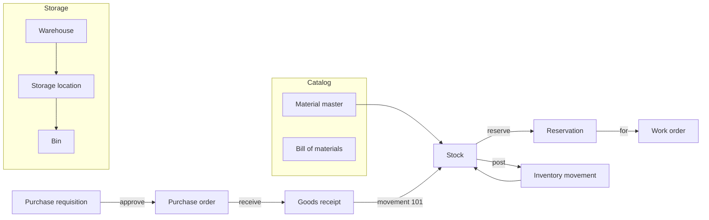
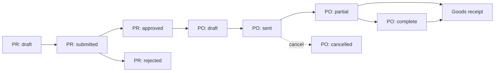

**Materials** is MRO (maintenance, repair, and operations) inventory for your assets — a spare-parts catalog, where stock physically lives, and the paper trail from "we need this part" to "it's on the shelf." It's informed by common ERP materials-management concepts (material types, movement codes, three-way procurement matching) without requiring you to run a full ERP.

<Note>
  Materials is currently **API-first**. There's no dedicated console module yet — use the HTTP API, or drive it from your own tooling, until a console UI ships.
</Note>

## Why it matters

MRO spend is usually a small share of total procurement, but a large share of transaction *volume* — lots of small orders, lots of stock movements, lots of "where's the spare bearing" moments. Structuring your catalog and giving each warehouse a real bin hierarchy pays off in fewer stockouts and faster work order turnaround, even before you touch procurement approvals.

## At a glance



## Core concepts

<CardGroup cols={2}>
  <Card title="Material master" icon="box">
    The catalog entry — number, name, type (spare, consumable, tool, and so on), base unit of measure, and reorder parameters. Defined once at the Organization level, with optional per-Project overrides.
  </Card>
  <Card title="Bill of materials (BOM)" icon="diagram-project">
    A recursive parts list linked to an asset, asset type, or material. "Explode" a BOM to get its full flattened component list, including sub-BOMs.
  </Card>
  <Card title="Warehouse hierarchy" icon="warehouse">
    Warehouse → storage location → bin. Stock always lives at a storage location; bins add barcode-level precision when you need it.
  </Card>
  <Card title="Reservations" icon="lock" href="#reservations">
    A hold against available stock for a work order (or other consumer), so two jobs don't compete for the same spare part.
  </Card>
</CardGroup>

## Scope: organization vs. project

Materials data sits at different levels, matching how the underlying entities actually work:

| Entity | Scope | Why |
|--------|-------|-----|
| Units of measure | Organization-wide | `kg` means the same thing everywhere |
| Material groups | Organization-wide | One taxonomy for cross-project spend analysis |
| Materials (catalog) | Organization-wide, with optional Project overrides | Define "10W-40 motor oil" once; override reorder point per plant if needed |
| Vendors, vendor pricing | Organization-wide | Vendor relationships are company-wide |
| Bills of materials | Either | Org-level template BOMs, or project-specific BOMs for custom equipment |
| Warehouses, storage locations, bins | Project-scoped | Physical locations exist inside a Project |
| Stock, movements, reservations | Project-scoped | Stock is physically at a location |
| Purchase requisitions, orders, receipts | Project-scoped | Procurement is for a specific plant |

Most create endpoints for organization-scoped resources are mounted under a Project for convenience — pass `"org_wide": true` in the request body to create the org-wide record instead of a project-specific one. List endpoints for org-scoped resources always return the org-wide catalog plus anything scoped to your current Project.

## Material master & catalog

A **material** has a type that controls how Golain treats it:

| Type | Meaning |
|------|---------|
| `spare` | Spare parts — failure-driven demand, criticality-based stocking |
| `consumable` | Operating supplies — continuous demand, min/max reorder |
| `raw` | Raw materials |
| `semi_finished` / `finished` | Intermediate or finished goods |
| `service` | A service line item — not inventory-tracked |
| `tool` | Tools and production resources |

Each material also carries a base unit of measure, an optional primary material group, and reorder parameters (`reorder_point`, `reorder_qty`, `safety_stock`, `lead_time_days`) that drive auto-reorder when stock runs low.

| Method | Path | Description |
|--------|------|--------------|
| `GET` | `/materials` | List materials (org-wide + Project-scoped) |
| `POST` | `/materials` | Create a material |
| `GET` | `/materials/{material_id}` | Get a material |
| `PATCH` | `/materials/{material_id}` | Update a material |
| `DELETE` | `/materials/{material_id}` | Delete a material |
| `PUT` | `/materials/{material_id}/override` | Set a Project-level override (price, reorder params) |
| `GET` | `/uoms` | List units of measure |
| `POST` | `/uoms` | Create a unit of measure |
| `GET` | `/material-groups` | List material groups |
| `GET` | `/vendors` | List vendors |
| `POST` | `/vendors` | Create a vendor |
| `PUT` | `/vendors/{vendor_id}/materials` | Upsert a vendor's price/lead time for a material |

## Bill of materials (BOM)

A BOM lists the components that make up an asset, asset type, or material, and can nest sub-BOMs. Use **explode** to get the fully flattened component list — useful before you provision a work order's parts, or plan a rebuild.

| Method | Path | Description |
|--------|------|--------------|
| `GET` | `/boms` | List BOMs |
| `POST` | `/boms` | Create a BOM |
| `GET` | `/boms/{bom_id}` | Get a BOM |
| `PATCH` | `/boms/{bom_id}` | Update a BOM |
| `DELETE` | `/boms/{bom_id}` | Delete a BOM |
| `GET` | `/boms/{bom_id}/explode` | Get the flattened component list, including sub-BOMs |
| `GET` | `/boms/{bom_id}/items` | List direct BOM items |
| `POST` | `/boms/{bom_id}/items` | Add a BOM item |
| `PATCH` | `/boms/{bom_id}/items/{item_id}` | Update a BOM item |
| `DELETE` | `/boms/{bom_id}/items/{item_id}` | Remove a BOM item |

## Storage: warehouses, storage locations, bins

Stock lives at a **storage location** inside a **warehouse**; **bins** add barcode-level addressing within a storage location when you need it.

| Method | Path | Description |
|--------|------|--------------|
| `GET`/`POST` | `/warehouses` | List / create warehouses |
| `GET`/`PATCH`/`DELETE` | `/warehouses/{warehouse_id}` | Get / update / delete a warehouse |
| `GET`/`POST` | `/storage-locations` | List / create storage locations |
| `POST` | `/storage-locations/batch` | Create several storage locations at once |
| `GET`/`PATCH`/`DELETE` | `/storage-locations/{storage_location_id}` | Get / update / delete a storage location |
| `GET`/`POST` | `/bins` | List / create bins |
| `GET`/`PATCH`/`DELETE` | `/bins/{bin_id}` | Get / update / delete a bin |

## Stock & movements

**Stock** is tracked per material, per storage location (and optionally per batch). Every quantity change goes through an **inventory movement** with a standardized movement type code, so you always have a clean audit trail:

| Code | Meaning |
|------|---------|
| `101` | Goods receipt against a purchase order |
| `201` | Goods issue to a cost center |
| `261` | Goods issue for a work order |
| `301` / `311` | Transfer between plants / within a plant |
| `501` | Goods receipt without a purchase order |
| `551` | Scrap |
| `701` / `702` | Physical inventory surplus / deficit |

| Method | Path | Description |
|--------|------|--------------|
| `GET` | `/stock` | List stock rows |
| `GET` | `/stock/{stock_id}` | Get a stock row |
| `POST` | `/stock/initial` | Post an opening stock quantity |
| `POST` | `/stock/adjust` | Adjust stock by a delta (physical count corrections) |
| `GET` | `/movements` | List inventory movements |
| `POST` | `/movements` | Post a movement with an explicit `movement_type_code` |

## Reservations

A **reservation** holds a quantity of stock for a specific consumer — most commonly a work order — so it can't be double-allocated. Reserved quantity reduces `available_qty` without changing on-hand `qty`. When a work order completes, the reservation is fulfilled and a goods-issue movement posts the actual consumption.

| Method | Path | Description |
|--------|------|--------------|
| `GET` | `/reservations` | List reservations |
| `POST` | `/reservations` | Create a reservation |
| `GET` | `/reservations/{reservation_id}` | Get a reservation |
| `POST` | `/reservations/{reservation_id}/cancel` | Cancel a reservation |

## Procurement: requisition → order → receipt

Procurement follows the standard three-step chain:

1. **Purchase requisition (PR)** — an internal request to buy something, with line items. Submit it, then approve or reject it.
2. **Purchase order (PO)** — a commitment sent to a vendor, optionally traceable back to a PR. Send it, or cancel it.
3. **Goods receipt (GR)** — records what physically arrived against a PO, posts a `101` movement, and updates the PO's delivered quantity.



| Method | Path | Description |
|--------|------|--------------|
| `GET`/`POST` | `/purchase-requisitions` | List / create a PR |
| `GET` | `/purchase-requisitions/{pr_id}` | Get a PR |
| `POST` | `/purchase-requisitions/{pr_id}/submit` | Submit for approval |
| `POST` | `/purchase-requisitions/{pr_id}/approve` | Approve |
| `POST` | `/purchase-requisitions/{pr_id}/reject` | Reject |
| `GET`/`POST` | `/purchase-orders` | List / create a PO |
| `GET` | `/purchase-orders/{po_id}` | Get a PO |
| `POST` | `/purchase-orders/{po_id}/send` | Send to vendor |
| `POST` | `/purchase-orders/{po_id}/cancel` | Cancel |
| `GET`/`POST` | `/goods-receipts` | List / create a goods receipt |
| `GET` | `/goods-receipts/{gr_id}` | Get a goods receipt |

<Note>
  Golain's procurement chain covers requisition, order, and receipt with standard approvals. It does **not** replace your general ledger or handle multi-currency accounting — treat it as the operational record, and reconcile financials in your accounting system.
</Note>

## Permissions

Base URL: `https://api.ilyama.golain.io/core/api/v1`. All routes are under `/projects/{project_id}/`.

Creating, updating, and deleting materials, groups, vendors, BOMs, warehouses, storage locations, bins, and all procurement mutations require **`can_manage_assets`** on the Project. Every list and get endpoint uses your standard Project read access.

## Example: create a material

```bash
export API=https://api.ilyama.golain.io/core/api/v1
export TOKEN=<your-oidc-access-token>
export ORG_ID=<your-org-uuid>
export PROJECT_ID=<your-project-uuid>
export UOM_ID=<your-uom-uuid>

curl -sS -X POST \
  -H "Authorization: Bearer $TOKEN" \
  -H "ORG-ID: $ORG_ID" \
  -H "Content-Type: application/json" \
  -d "{
    \"material_number\": \"BRG-6205\",
    \"name\": \"Ball bearing 6205\",
    \"mtype\": \"spare\",
    \"base_uom_id\": \"$UOM_ID\",
    \"reorder_point\": 4,
    \"reorder_qty\": 10,
    \"safety_stock\": 2,
    \"is_batch_managed\": false
  }" \
  "$API/projects/$PROJECT_ID/materials"
```

## Example: post an inventory movement

Issue two bearings from stock for a work order (movement type `261`):

```bash
export MATERIAL_ID=<material-uuid-from-create-response>
export STORAGE_LOCATION_ID=<your-storage-location-uuid>
export TICKET_ID=<work-order-ticket-uuid>

curl -sS -X POST \
  -H "Authorization: Bearer $TOKEN" \
  -H "ORG-ID: $ORG_ID" \
  -H "Content-Type: application/json" \
  -d "{
    \"movement_type_code\": \"261\",
    \"material_id\": \"$MATERIAL_ID\",
    \"qty\": 2,
    \"from_location_id\": \"$STORAGE_LOCATION_ID\",
    \"ref_type\": \"work_order\",
    \"ref_id\": \"$TICKET_ID\",
    \"reason\": \"Bearing replacement on P-101\"
  }" \
  "$API/projects/$PROJECT_ID/movements"
```

## Example: create a reservation

Reserve stock for a work order before you start the job, so the parts are guaranteed to be there:

```bash
curl -sS -X POST \
  -H "Authorization: Bearer $TOKEN" \
  -H "ORG-ID: $ORG_ID" \
  -H "Content-Type: application/json" \
  -d "{
    \"material_id\": \"$MATERIAL_ID\",
    \"qty\": 2,
    \"uom_id\": \"$UOM_ID\",
    \"storage_location_id\": \"$STORAGE_LOCATION_ID\",
    \"ref_type\": \"work_order\",
    \"ref_id\": \"$TICKET_ID\"
  }" \
  "$API/projects/$PROJECT_ID/reservations"
```

Cancel it if the job is called off before the parts are consumed:

```bash
export RESERVATION_ID=<reservation-id-from-create-response>

curl -sS -X POST \
  -H "Authorization: Bearer $TOKEN" \
  -H "ORG-ID: $ORG_ID" \
  "$API/projects/$PROJECT_ID/reservations/$RESERVATION_ID/cancel"
```

<Note>
  Spend and cost KPIs (MRO spend trend, and similar reports) currently use each material's configured unit price, not a point-in-time purchase price. If you need spend figures tied to actual PO pricing, track it in your own reporting until purchase-price-aware KPIs ship.
</Note>

## Related

- [Assets overview](/assets/overview) — how materials fits with asset trees and maintenance
- [Maintenance](/assets/maintenance) — reserve and consume parts on work orders, and where reservations get created from
- [Counters](/assets/counters) — usage data that can inform reorder timing
- [KPIs & reporting](/assets/kpis-and-reporting) — MRO spend trend and inventory reports
