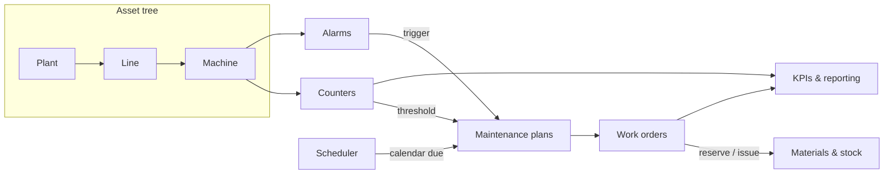

Golain's **Assets & maintenance** capability adds industrial EAM (Enterprise Asset Management) on top of your existing Organization and Project. Model any physical hierarchy as a recursive **asset tree**, track usage with **counters** fed by telemetry, run preventive and condition-based maintenance through **work orders**, manage **spare parts and stock**, and watch process **alarms** — all scoped to a Project and queryable through the same platform APIs you already use for devices and fleets.

## Who this is for

| Role | Start here |
|------|------------|
| Plant / reliability engineer | [Asset tree](/assets/asset-tree) → [Counters](/assets/counters) → [KPIs & reporting](/assets/kpis-and-reporting) |
| MRO / maintenance planner | [Maintenance](/assets/maintenance) → [Materials](/assets/materials) → [Scheduler](/assets/scheduler) |
| Integrator / backend developer | [API quickstart](/assets/api-quickstart) → [Asset tree](/assets/asset-tree) → [Counters](/assets/counters) |
| Operations / process engineer | [Alarms](/assets/alarms) → [KPIs & reporting](/assets/kpis-and-reporting) |

## At a glance



An **asset tree** (plant → line → machine → component) carries **counters** (running hours, energy, cycles) and **alarms** for each node. Counter thresholds, alarm activations, and the **scheduler**'s calendar events all feed **maintenance plans**, which generate **work orders**. Work orders can reserve and consume **materials** from stock. Everything rolls up into OEE-style **KPIs and reporting**.

## Core concepts

<CardGroup cols={2}>
  <Card title="Asset tree" icon="sitemap" href="/assets/asset-tree">
    Model plants, lines, machines, and components as a recursive tree. Link any node to a Device, Fleet, or Project, and track group quantities like "1000 bolts" as one asset.
  </Card>
  <Card title="Counters" icon="gauge" href="/assets/counters">
    Define running-hours, energy, or cycle counters driven by telemetry. Golain coalesces readings and evaluates thresholds so you get maintenance triggers without polling.
  </Card>
  <Card title="Maintenance" icon="wrench" href="/assets/maintenance">
    Preventive maintenance plans triggered by calendar, counter thresholds, or conditions. Each plan generates work orders on your existing ticketing workflow.
  </Card>
  <Card title="Materials" icon="boxes-stacked" href="/assets/materials">
    Spare parts and consumables with stock levels, movements, and reservations tied to work orders.
  </Card>
  <Card title="Alarms" icon="triangle-exclamation" href="/assets/alarms">
    ISA-18.2-style alarm definitions and instances with acknowledgment tracking and deduplication.
  </Card>
  <Card title="Scheduler" icon="calendar-clock" href="/assets/scheduler">
    Shared recurrence engine (RFC 5545 RRules) that drives calendar-based maintenance plans and other periodic jobs.
  </Card>
  <Card title="KPIs & reporting" icon="chart-line" href="/assets/kpis-and-reporting">
    OEE, MTBF/MTTR, and spend dashboards built from counter and activity data.
  </Card>
  <Card title="API quickstart" icon="code" href="/assets/api-quickstart">
    Authenticate and make your first asset API calls with curl.
  </Card>
</CardGroup>

## Prerequisites

Before you create assets:

1. **Organization and Project** — assets are Project-scoped, same as devices and fleets. See [Platform concepts](/getting-started/concepts).
2. **API auth** — every request sends `Authorization: Bearer {token}` and `ORG-ID`, the same as other platform APIs.
3. **Permission** — mutating routes (create, update, delete, move, link, status) require `can_manage_assets` on the Project. Read routes use your existing project access.

<Note>
  Assets and maintenance are currently **API-first**. The console (`pw`) does not yet have a dedicated Assets module — use the HTTP API or automate with scripts until a console UI ships.
</Note>

## Typical first-time flow

1. **Define an asset type** — a project-scoped taxonomy entry (for example `pump`, `cnc_station`, `bolt`) that classifies assets and can carry a default attribute schema.
2. **Create your top-level assets** — a plant, then lines and machines underneath, using `parent_asset_id` to build the tree.
3. **Link a Device or Fleet** — attach an existing Device or Fleet to the asset node it represents, so operators can jump from the asset to live device data.
4. **Define a counter** (optional) — a running-hours or energy counter fed by a dataspace, with thresholds that flag when maintenance is due.
5. **Create a maintenance plan** (optional) — attach a calendar or counter-triggered plan so work orders generate automatically.

See [Asset tree](/assets/asset-tree) for the create/link/move calls, and [API quickstart](/assets/api-quickstart) for a full walkthrough.

## API surface

All asset routes live under the standard management API:

```
https://api.ilyama.golain.io/core/api/v1/projects/{project_id}/assets
https://api.ilyama.golain.io/core/api/v1/projects/{project_id}/asset-types
```

Counters, maintenance, materials, and alarms follow the same `projects/{project_id}/…` pattern — see each subsystem's page for exact paths.

## Scope

Assets & maintenance covers asset identity, counters, preventive/condition-based maintenance, spare-parts inventory, alarms, and a shared scheduler. It intentionally does **not** include:

- Full financial accounting (general ledger, multi-currency) — only inventory valuation.
- Predictive maintenance ML models — counters and thresholds give you the data; model training is a separate concern.
- A visual asset map / floor-plan editor — today's surface is the API (and any tree view your own frontend builds on it).

Work orders are implemented as tickets on a dedicated maintenance workflow, so they inherit the same assignment, forms, and status tracking you already use for other ticket types.

## Next steps

- [Asset tree](/assets/asset-tree) — create asset types, build the tree, link devices, move and re-tag nodes
- [Counters](/assets/counters) — define telemetry-driven counters and thresholds
- [Maintenance](/assets/maintenance) — plans and work orders
- [Materials](/assets/materials) — spare parts and stock
- [Alarms](/assets/alarms) — alarm definitions and instances
- [Scheduler](/assets/scheduler) — recurring schedules that drive plans
- [KPIs & reporting](/assets/kpis-and-reporting) — dashboards and formulas
- [API quickstart](/assets/api-quickstart) — curl walkthrough
