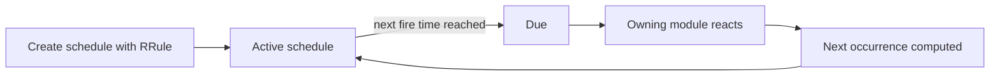

The **scheduler** is a project-scoped recurrence engine you can use to run anything on a repeating schedule — a weekly preventive maintenance round, a monthly inspection, or any other recurring plan. You describe the recurrence with a standard **RFC 5545 RRule** (the same format used by calendar apps), and Golain computes when it's next due and fires it automatically.

You don't call the scheduler directly to *do* work — you create a schedule, and the module that owns it (for example, maintenance planning) reacts when it comes due.

## At a glance



## Core concepts

<CardGroup cols={2}>
  <Card title="RRule recurrence" icon="repeat">
    Recurrence is described with an RRule, e.g. `FREQ=MONTHLY;INTERVAL=3;BYDAY=MO` for "every 3 months on a Monday" — the same syntax as iCalendar.
  </Card>
  <Card title="Preview occurrences" icon="calendar">
    Before or after creating a schedule, preview the next N occurrences without waiting for them to actually fire.
  </Card>
  <Card title="Activate / deactivate" icon="toggle-on">
    Pause a schedule without deleting it — deactivated schedules keep their configuration but stop firing.
  </Card>
  <Card title="Owning module" icon="link" href="/assets/maintenance">
    Each schedule is tied to the feature that created it. For example, a maintenance plan's calendar-based PM schedule is reacted to by the maintenance module — see [Maintenance](/assets/maintenance).
  </Card>
</CardGroup>

## How it works

1. You (or a feature that uses schedules on your behalf, like a maintenance plan) create a schedule with an RRule, a start time, and a timezone.
2. Golain computes the next time the schedule is due and keeps the schedule active.
3. When that time arrives, Golain marks the schedule as fired and lets the owning feature know it's due, so that feature can do its work — for example, opening a preventive maintenance work order.
4. Golain computes the following occurrence from the RRule and keeps the schedule running until you deactivate it, delete it, or its `dtend` passes.

<Note>
  Maintenance calendar plans are the most common consumer of schedules today — see [how PM plans use schedules](/assets/maintenance) for the maintenance-specific view. The scheduler itself is generic: any Golain feature can register schedules the same way.
</Note>

## Misfire handling

If Golain (or your deployment) is briefly unavailable when a schedule was due, the `misfire_policy` on the schedule decides what happens when it comes back:

| Policy | Behavior |
|--------|----------|
| `fire_once` *(default)* | Fire once immediately for the missed occurrence, then resume the normal cadence |
| `skip` | If the schedule is more than `misfire_grace_seconds` late, skip the missed occurrence and wait for the next one |
| `fire_all` | Fire once for every missed occurrence — use only when every occurrence must be accounted for, since a long outage can produce a burst |

`misfire_grace_seconds` (default 3600) controls how late is "late enough to matter" for the `skip` policy.

<Note>
  Golain also applies a small amount of jitter (a few seconds, deterministic per schedule) to when a schedule actually fires, to avoid many schedules firing in the exact same instant. This doesn't affect the RRule's logical occurrence time, only when the due signal goes out.
</Note>

## API reference

Schedules are scoped to a project.

| Method | Path | Description |
|--------|------|--------------|
| `GET` | `/projects/{project_id}/schedules` | List schedules in the project |
| `POST` | `/projects/{project_id}/schedules` | Create a schedule |
| `GET` | `/projects/{project_id}/schedules/{schedule_id}` | Get a schedule |
| `GET` | `/projects/{project_id}/schedules/{schedule_id}/occurrences?n=` | Preview the next `n` occurrences |
| `PATCH` | `/projects/{project_id}/schedules/{schedule_id}` | Update a schedule |
| `DELETE` | `/projects/{project_id}/schedules/{schedule_id}` | Delete a schedule |
| `POST` | `/projects/{project_id}/schedules/{schedule_id}/activate` | Resume a paused schedule |
| `POST` | `/projects/{project_id}/schedules/{schedule_id}/deactivate` | Pause a schedule without deleting it |

Creating, updating, deleting, activating, and deactivating all require **`can_manage_assets`** on the project.

### Schedule fields

| Field | Description |
|-------|--------------|
| `key`, `name`, `description` | Identity and display |
| `rrule` | RFC 5545 recurrence rule, e.g. `FREQ=WEEKLY;BYDAY=MO` |
| `dtstart` | When the recurrence begins (ISO 8601) |
| `dtend` *(optional)* | Stop generating occurrences after this time |
| `timezone` | IANA timezone the RRule is evaluated in, e.g. `America/New_York` |
| `exdates` *(optional)* | Specific occurrence timestamps to skip |
| `owner_domain` | Which feature owns this schedule (set by the feature that creates it, e.g. `cmms` for maintenance plans) |
| `owner_entity_id`, `owner_ref` *(optional)* | Context the owning feature passes to itself when the schedule fires |
| `is_active` | Whether the schedule currently fires |
| `misfire_policy`, `misfire_grace_seconds` | See [Misfire handling](#misfire-handling) |

## Example: create a weekly schedule

```bash
export API=https://api.ilyama.golain.io/core/api/v1
export TOKEN=<your-oidc-access-token>
export ORG_ID=<your-org-uuid>
export PROJECT_ID=<your-project-uuid>

curl -sS -X POST \
  -H "Authorization: Bearer $TOKEN" \
  -H "ORG-ID: $ORG_ID" \
  -H "Content-Type: application/json" \
  -d '{
    "key": "weekly_lube_check",
    "name": "Weekly lubrication check",
    "rrule": "FREQ=WEEKLY;BYDAY=MO",
    "dtstart": "2026-08-03T08:00:00Z",
    "timezone": "America/New_York",
    "owner_domain": "cmms",
    "owner_entity_id": "<maintenance-plan-uuid>"
  }' \
  "$API/projects/$PROJECT_ID/schedules"
```

## Example: preview upcoming occurrences

```bash
export SCHEDULE_ID=<your-schedule-uuid>

curl -sS \
  -H "Authorization: Bearer $TOKEN" \
  -H "ORG-ID: $ORG_ID" \
  "$API/projects/$PROJECT_ID/schedules/$SCHEDULE_ID/occurrences?n=5"
```

```json
{
  "ok": 1,
  "data": {
    "items": [
      "2026-08-03T12:00:00Z",
      "2026-08-10T12:00:00Z",
      "2026-08-17T12:00:00Z",
      "2026-08-24T12:00:00Z",
      "2026-08-31T12:00:00Z"
    ]
  }
}
```

Add `after=<ISO timestamp>` to preview occurrences starting from a specific time instead of now.

<Note>
  A single deployment runs one scheduler process by default, which comfortably handles typical project volumes. Running multiple scheduler replicas behind a shard key is an operational scale-out option, not something you configure per schedule — see [Self-hosted overview](/self-hosted/overview) if you're planning capacity for a very large number of schedules.
</Note>

## Related

- [Maintenance](/assets/maintenance) — how preventive maintenance plans use schedules
- [Counters](/assets/counters) — usage-based triggers as an alternative to time-based schedules
- [Assets](/assets/overview) — asset types, hierarchy, and identity
