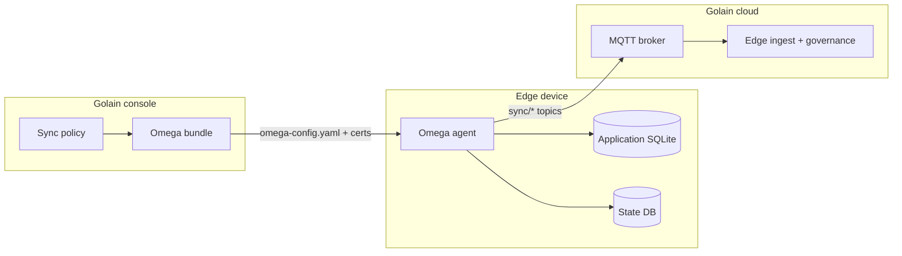

After you [create a sync policy and download a bundle](/console/edge-sync) from the Golain console, deploy the **Omega agent** on your device. The agent runs the `sqlite-replication` and `heartbeat` modules and connects to Golain over MQTT.

Repository: [golain-io/omega-rs](https://github.com/golain-io/omega-rs)

## Architecture



**Console** owns policy definition and packaging.

**Omega agent** owns runtime replication — watching the source database, publishing batches, and listening for cloud control messages.

**Golain cloud** owns materialization — lineages, schema reviews, and mirror tables appear in the console after ingest.

## Prerequisites

- Completed [Edge Sync console setup](/console/edge-sync) — policy attached, bundle downloaded
- Network path to the MQTT broker (TLS or QUIC per your certificate)
- Application SQLite database on the device

## Step 1 — Download the Omega binary

1. Unzip the console bundle on the device.
2. Open `OMEGA_DOWNLOAD_URL.txt` and download the binary for your selected channel (`stable`, `latest`, or `dev`) and architecture.
3. Make it executable:

```bash
chmod +x omega-agent
```

<Note>
  You can also build from source: `cargo build --release -p omega-agent` in the [omega-rs](https://github.com/golain-io/omega-rs) repository.
</Note>

## Step 2 — Place certificates

Copy certificate files to the paths referenced in `omega-config.yaml`. The console bundle defaults to:

```
./certs/ca.crt
./certs/device.crt
./certs/device.key
```

## Step 3 — Configure the source database path

Edit `omega-config.yaml` and set `sqlite-replication.source_db_path` to your application's SQLite file:

```yaml
sqlite-replication:
  source_db_path: "/var/lib/myapp/data.db"
  state_db_path: "/var/lib/omega/state.db"
```

Default paths in the bundle are `/var/lib/omega/source.db` and `/var/lib/omega/state.db`. Create the directories if needed.

## Step 4 — Start the agent

```bash
./omega-agent --profile omega-config.yaml
```

For development from source:

```bash
cargo run -p omega-agent -- --profile omega-config.yaml
```

For production, install as a systemd service and point the unit at your config path. → [Deploy Omega](/edge/deploy)

## Generated config reference

A typical console-generated config:

```yaml
name: my-edge-device
connection:
  transport: mqtt
  server_url: "ssl://mqtt.example.golain.io:8883"
  device_id: "device-uuid-here"
  root_topic: "devices/acme/my-edge-device/device-data"
  mqtt:
    keep_alive: 30s
    clean_session: false
    tls:
      ca_cert_path: "./certs/ca.crt"
      client_cert_path: "./certs/device.crt"
      client_key_path: "./certs/device.key"
modules:
  required: [sqlite-replication, heartbeat]
security:
  max_payload_bytes: 262144
  capabilities:
    sqlite-replication: true
    heartbeat: true
sqlite-replication:
  source_db_path: "/var/lib/omega/source.db"
  state_db_path: "/var/lib/omega/state.db"
  flush_interval: 5s
  snapshot_on_first_run: true
  table_strategies:
    device_state:
      strategy: rows
    sensor_readings:
      strategy: telemetry
      ts_column: recorded_at
      include_columns: [value, unit]
```

### Agent modules enabled by the bundle

| Module | Role |
|--------|------|
| **sqlite-replication** | Watches the source SQLite file, captures changes, flushes to MQTT |
| **heartbeat** | Publishes liveness so the console shows device online/offline status |

→ Full field reference: [Configuration](/edge/data-sync/configuration)

## MQTT topics

Topics are prefixed with `connection.root_topic` from the bundle.

Example root: `devices/acme/edge-01/device-data`

| Direction | Topic suffix | Purpose |
|-----------|--------------|---------|
| Device → Cloud | `sync/rows/batch` | Row-level INSERT/UPDATE/DELETE batches |
| Device → Cloud | `sync/telemetry/batch` | Time-series batches |
| Device → Cloud | `sync/schema/observe` | Schema fingerprint on change |
| Device → Cloud | `sync/ingest/request` | Request presigned URL for large uploads |
| Cloud → Device | `sync/ingest/control` | Pause, resume, state write, URL grant |
| Device → Cloud | `sync/ingest/ack` | Acknowledge control messages |

→ [Topics and connection](/edge/data-sync/topics-and-connection) · [Downlink control](/edge/data-sync/downlink-control)

## Step 5 — Verify

1. **Fleet & Devices** — device status shows **connected**.
2. **Edge Sync → Governance → Lineages** — one lineage per replicated table.
3. **Schema Reviews** — approve queued reviews for new tables. → [Schema review workflow](/edge/data-sync/schema-review-workflow)
4. **Query data** — after approval, use dashboards or the API. → [Querying synced data](/edge/data-sync/querying-data)

## Troubleshooting (agent)

| Problem | Likely cause | Fix |
|---------|--------------|-----|
| Agent won't start | `source_db_path` missing or wrong | Point to a real SQLite file |
| `rows` table silent | No primary key | Add a PK to the table |
| No telemetry | Wrong `ts_column` | Fix in sync policy; re-download bundle if needed |
| Changes not detected | App not committing writes | Ensure SQLite transactions commit |
| Stale data after DB swap | Expected behavior | Agent detects file replacement and re-snapshots |
| Cloud writes ignored | Table lacks PK | `state_write` requires primary keys |

### Verification checklist

- [ ] Agent connected (check logs / device status in console)
- [ ] MQTT ACL allows publish on `{root}/sync/#` and subscribe on `{root}/sync/ingest/control`
- [ ] Source DB is receiving writes
- [ ] Internal `__omega_journal` table exists after bootstrap — **do not modify**
- [ ] Console **Lineages** shows entries for configured tables
- [ ] **Schema reviews** appear when schema changes

### Internal tables (do not replicate)

The agent creates and manages these. Console schema upload excludes them automatically:

- `__omega_journal`, `__omega_journal_seq` — change capture
- `__omega_db_instance` — database swap detection

→ [Troubleshooting](/edge/data-sync/troubleshooting)

## Alternative: golain CLI scaffold

If you prefer the terminal over a console bundle, use `golain omega scaffold` to generate equivalent config and binaries:

```bash
golain omega scaffold --device=my-device --fleet=my-fleet --transport=tls
```

→ [golain Omega deploy](/tools/platform-tui/omega-deploy)

## Related

<CardGroup cols={2}>
  <Card title="Edge Sync in the console" icon="desktop" href="/console/edge-sync">
    Create policies, attach devices, download bundles.
  </Card>
  <Card title="Capture strategies" icon="table" href="/edge/data-sync/capture-strategies">
    Rows vs telemetry vs ignore in depth.
  </Card>
  <Card title="Provisioning checklist" icon="list-check" href="/edge/data-sync/provisioning-checklist">
    Pre-flight checklist before first sync.
  </Card>
</CardGroup>
