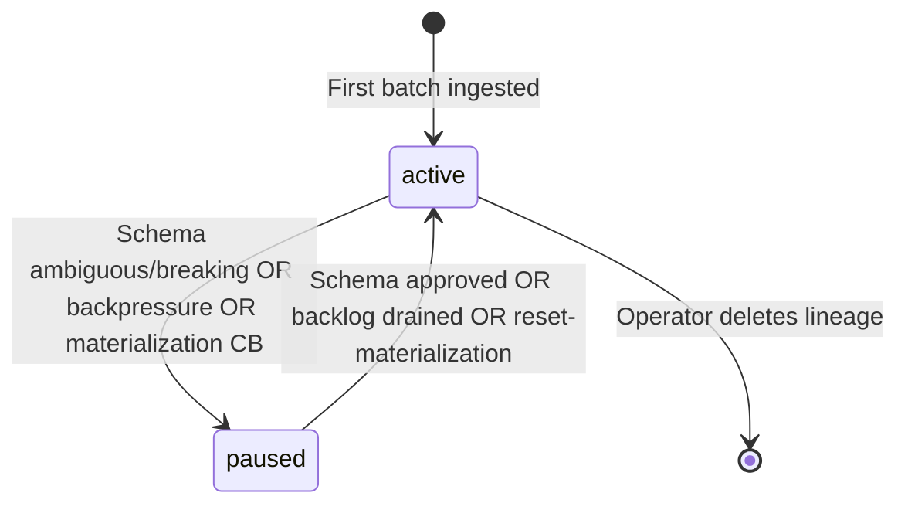

A **lineage** is the cloud's record of syncing one **SQLite table** from one **device**. Staging is where row data waits when the lineage cannot materialize yet.

## Lineage definition

```
Lineage = (device_id, source_table)
```

Examples:

- Device `warehouse-gw-01`, table `device_state` → one lineage
- Same device, table `order_events` → a second lineage

Each lineage has independent status, schema versions, reviews, and materialization counters.

## Lineage status

| Status | Meaning |
|--------|---------|
| `active` | Ingest accepts batches; live rows materialize when bindings exist |
| `paused` | New rows may be **staged** instead of written to mirror; may or may not trigger device downlink |

Check status in **platform-tui → Edge Sync → Lineages** or `GET /projects/{id}/edge/lineages`.

## Lifecycle



### First batch

1. Worker creates lineage row (usually `active` briefly).
2. If schema is unseen and policy requires review → classification `ambiguous`.
3. Lineage flips to **`paused`**, review **`queued`**, rows go to **`edge_staged_rows`**.

### After schema approval

1. Mirror table DDL provisioned (`edge_mirror_{device8}_{table}` or coalesced name).
2. **Replay intent** scheduled — staged rows drain into mirror.
3. Lineage **`active`** — subsequent live batches materialize directly.

### Volume backpressure

When staged row count or bytes exceed policy caps (defaults: **100,000 rows** / **1 GiB** per lineage):

1. Lineage **`paused`**.
2. Server sends **`pause_lineage`** downlink to device.
3. Device stops publishing that table and buffers locally.
4. When backlog drops below **80%** of caps, server sends **`resume_lineage`**.

→ [Backpressure](/edge/data-sync/backpressure)

### Materialization circuit breaker

After **5+ permanent** materialization errors on an active lineage:

1. Lineage **`paused`**, **`pause_lineage`** downlink sent.
2. Operator fixes root cause (DDL, bindings, TSDB issue).
3. `POST .../lineages/{id}/reset-materialization` clears error state and may resume.

## Staging

### What is staged?

Full row payloads (insert/update/delete operations) as JSON, keyed by:

- `device_id`, `source_table`, `source_commit_seq`
- `staging_reason`
- Inline payload or compressed blob (server-internal)

### Why rows stage

| Reason | Operator action |
|--------|-----------------|
| `schema_review` | Complete [schema review workflow](/edge/data-sync/schema-review-workflow) |
| `lineage_paused` | Wait for auto-resume (backpressure) or investigate pause cause |
| `materialization_failed` | Check lineage materialization errors; reset if needed |

### Inspecting staged rows

**platform-tui:**

1. Edge Sync → Lineages → select lineage
2. Press **`d`** for staged data (or **`w`** for written/mirror)

**HTTP API:**

```
GET /core/api/v1/projects/{project_id}/edge/lineages/{lineage_id}/staged-rows
```

Paginate with `page` and `limit` query params.

<Tip>
  Staged rows prove the device **is sending data** even when mirror tables are empty — always check staged view before debugging MQTT connectivity.
</Tip>

## Related OLTP objects

Each lineage links to:

| Object | Purpose |
|--------|---------|
| `edge_schema_versions` | History of `schema_hash` + classification |
| `edge_schema_reviews` | Open or resolved review tickets |
| `edge_column_bindings` | Approved mapping: source column → mirror or telemetry |
| `edge_replay_intents` | Durable replay job after approve |
| `edge_pending_controls` | Outstanding downlink pause/resume/url_grant |

## Deleting a lineage

`DELETE .../edge/lineages/{lineage_id}` removes cloud sync state for that table on that device. It does **not** delete the edge SQLite database or Omega triggers.

Use when retiring a table sync or resetting a botched enrollment. Requires **`PROJECT_CAN_MANAGE_DEVICES`**.

platform-tui: lineage detail → **`D`** (confirm).

## Edge-side state (Omega)

Separate from cloud lineage, Omega persists in **`state.db`**:

- Last published `commit_seq` per table
- `journal_epoch` per table
- Pause watermarks from downlink controls
- Local backpressure buffer

Cloud lineage status and edge pause state can diverge briefly during schema review (cloud paused, device still sending).

→ [Configuration — state database](/edge/data-sync/configuration)
