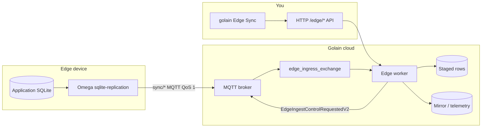

**Edge SQLite sync** (also called **edge replication**) mirrors data from a SQLite database on your device into Golain cloud storage. Changes are captured on the device, sent over **MQTT**, governed on the server, and materialized into queryable **mirror tables** or **telemetry** series.

This is not a file-level SQLite backup. The cloud stores governed, typed projections — not a copy of your `.db` file.

## Who this is for

| Role | Start here |
|------|------------|
| Fleet operator / platform admin | [How it works](/edge/data-sync/how-it-works) → [Schema review workflow](/edge/data-sync/schema-review-workflow) |
| Edge engineer shipping Omega | [Omega setup](/edge/data-sync/omega-setup) → [Configuration](/edge/data-sync/configuration) |
| Integrator building a custom agent | [Wire protocol reference](/edge/data-sync/topics-and-connection) |
| SRE / on-call | [Troubleshooting](/edge/data-sync/troubleshooting) |

## At a glance

## Core concepts

<CardGroup cols={2}>
  <Card title="Lineage" icon="diagram-project" href="/edge/data-sync/lineages-and-staging">
    One sync relationship per device + SQLite table. Tracks active/paused status and materialization health.
  </Card>
  <Card title="Staging" icon="layer-group" href="/edge/data-sync/lineages-and-staging">
    Rows held in cloud storage while schema is under review or lineage is paused — not lost.
  </Card>
  <Card title="Schema review" icon="clipboard-check" href="/edge/data-sync/schema-governance">
    Human approval when a table's schema is new or changed. You decide which columns mirror to the cloud.
  </Card>
  <Card title="Materialization" icon="database" href="/edge/data-sync/querying-data">
    Approved rows land in `edge_mirror_*` tables or telemetry — queryable from the platform.
  </Card>
</CardGroup>

## Components

| Piece | Repository | Role |
|-------|------------|------|
| **Omega** `sqlite-replication` module | [golain-io/omega](https://github.com/golain-io/omega) | Triggers, journal, MQTT publish, pause/resume on device |
| **MQTT broker** | [golain-io/ilyama](https://github.com/golain-io/ilyama) | mTLS auth, topic ACL, fan-in to `edge_ingress_exchange`, downlink delivery on `sync/ingest/control` |
| **Edge worker** | ilyama | Ingest (Pipeline A telemetry + Pipeline B state rows), classify schema, stage, review RPC, replay, mirror DDL, cloud state write-back |
| **HTTP API + golain** | ilyama | Operator governance and inspection |

Reference client: **`ilyama-edge`** (`omega/clients/ilyama-edge.yaml`).

<Note>
  Edge v2 runs a **dedicated edge worker** on `edge_ingress_exchange` and `edge_exchange`. The integration worker no longer ingests edge sync batches. After upgrading, confirm the edge worker is registered and run `make rabbitmq-topology` so ingress queues exist.
</Note>

## Typical first-time flow

1. **Register device** in console or `golain` — note device **name** (used as MQTT client ID / topic segment).
2. **Scaffold Omega** with `golain omega scaffold` or [install manually](/edge/install) — issues certs, downloads Omega + SQLite deps.
3. **Configure Omega** with generated `omega-config.yaml` / `omega-env.sh` (or manual `OMEGA_*` vars).
4. **Start Omega** — module installs triggers on user tables; first batches arrive in cloud.
5. **Approve schema** — default policy queues review on first sight of a table; claim + approve in Edge Sync.
6. **Query data** — mirror rows via API/TUI or QueryScript after materialization.

<Note>
  With default governance policy, the **first batch** from a new table triggers a schema review and the lineage enters **paused** until you approve. The device can keep sending; the cloud **stages** rows server-side during review (both telemetry and row-batch pipelines).
</Note>

## Documentation map

### Concepts
- [How it works](/edge/data-sync/how-it-works) — end-to-end pipeline
- [Lineages and staging](/edge/data-sync/lineages-and-staging)
- [Schema governance](/edge/data-sync/schema-governance)
- [Registry coalescing](/edge/data-sync/registry-coalescing) — project/fleet-wide schema sharing
- [Backpressure](/edge/data-sync/backpressure) — pause/resume when backlog grows

### Edge agent
- [golain Omega deploy](/tools/platform-tui/omega-deploy)
- [Omega setup](/edge/data-sync/omega-setup)
- [Configuration reference](/edge/data-sync/configuration)
- [Capture strategies](/edge/data-sync/capture-strategies)
- [Provisioning checklist](/edge/data-sync/provisioning-checklist)

### Operations
- [Schema review workflow](/edge/data-sync/schema-review-workflow) — step-by-step operator guide
- [golain Edge Sync](/edge/data-sync/platform-tui-guide)
- [HTTP API](/edge/data-sync/api-reference)
- [Querying synced data](/edge/data-sync/querying-data)
- [Troubleshooting](/edge/data-sync/troubleshooting)

### Wire protocol (integrators)
- [Topics and connection](/edge/data-sync/topics-and-connection)
- [Payload formats](/edge/data-sync/payload-formats)
- [Downlink control](/edge/data-sync/downlink-control)
- [Limits, dedup, and errors](/edge/data-sync/limits-dedup-errors)

Normative spec in source: [ilyama edge-client-guide](https://github.com/golain-io/ilyama/blob/main/docs/knowledge/edge-client-guide.md).

## Current limitations

Document these when planning production rollouts:

| Area | Limitation |
|------|------------|
| Omega telemetry batches | `sync/telemetry/batch` flush is not fully implemented — use `strategy: rows` for time-series-shaped tables |
| Bootstrap snapshot | `snapshot_on_first_run` flag exists but is **not implemented** — only mutations **after** Omega starts replicate |
| Secondary upload flow | Presigned URL bootstrap/spill path specified but not implemented in Omega |
| golain TUI approve shortcut | TUI **`a`** auto-maps columns from registry schema — use HTTP API for bespoke `column_actions` |
| Authz on mirror reads | Product-level authorized reads for mirror tables still evolving |

See [Troubleshooting](/edge/data-sync/troubleshooting) for operational workarounds.
