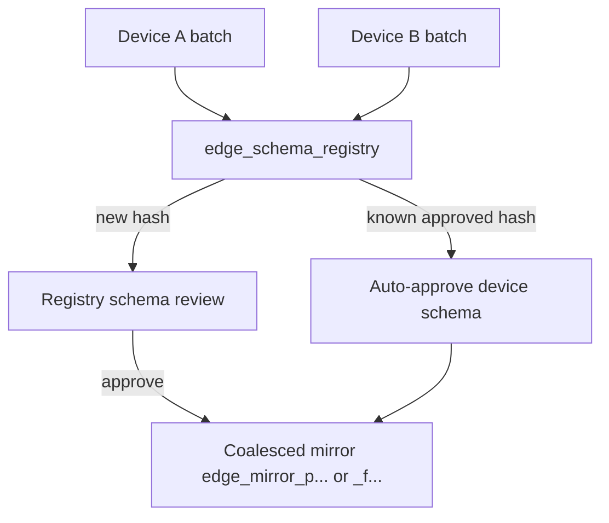

By default, each device gets its own schema review and **device-scoped mirror table** (`edge_mirror_{device8}_{table}`). **Registry coalescing** lets many devices sharing the same table shape reuse one schema decision and one **coalesced mirror**.

## When to use coalescing

| Scenario | Coalescing mode |
|----------|-----------------|
| Heterogeneous devices, different schemas per device | `none` (default) |
| Fleet of identical gateways syncing `device_state` | `fleet` |
| Project-wide standard table layout | `project` |

Coalescing reduces operator toil: approve once, auto-approve subsequent devices with the same `schema_hash`.

## How it works



1. First device announces hash `H` for table `telemetry_readings` → **registry review** created.
2. Operator approves with column actions at registry scope.
3. Second device sends same hash `H` → **device schema auto-approved**, rows materialize to shared mirror.
4. Physical table name pattern:
   - Project scope: `edge_mirror_p{project8}_{table}`
   - Fleet scope: `edge_mirror_f{fleet8}_{table}`

## Policy configuration

Set coalescing mode at project level:

```
PATCH /core/api/v1/projects/{project_id}/edge/policy
```

Body includes `schema_coalescing_mode`: `none` | `project` | `fleet`.

Requires **`Idempotency-Key`** and manage-devices permission.

## Registry HTTP routes (project scope)

| Method | Path | Purpose |
|--------|------|---------|
| GET | `/edge/registry` | List schema registry entries |
| GET | `/edge/registry/{registry_id}` | Registry entry detail |
| GET | `/edge/registry-reviews` | List registry-level reviews |
| GET | `/edge/registry-reviews/{review_id}` | Review detail |
| POST | `/edge/registry-reviews/{review_id}/claim` | Claim review |
| POST | `/edge/registry-reviews/{review_id}/approve` | Approve with column actions |
| POST | `/edge/registry-reviews/{review_id}/reject` | Reject |
| POST | `/edge/registry-reviews/{review_id}/abandon` | Abandon |
| GET | `/edge/coalesced-mirrors` | List coalesced mirrors |
| GET | `/edge/coalesced-mirrors/{mirror_id}` | Mirror detail |
| POST | `/edge/coalesced-mirrors/{source_table}/consolidate` | Phase-2 consolidation |

**Fleet-scoped** equivalents exist under:

```
/projects/{project_id}/fleets/{fleet_id}/edge/...
```

See [API reference](/edge/data-sync/api-reference).

## Consolidation

`consolidate` merges device-scoped mirrors into a coalesced mirror when migrating from `none` → `project`/`fleet` mode. Use during fleet standardization projects — coordinate with Golain support for large fleets.

## platform-tui gap

Registry reviews and coalesced mirror management are **HTTP API only** today. The TUI covers per-device lineages and device-scoped schema reviews.

Use `curl`, OpenAPI client, or automation against registry routes until TUI support lands.

## Operator checklist (coalesced fleet)

1. Set `schema_coalescing_mode=fleet` on project policy.
2. Enroll first device → complete **registry review** (not just device review).
3. Roll out identical schema to additional devices.
4. Verify rows in coalesced mirror via `GET .../coalesced-mirrors/{id}`.
5. Query with fleet-scoped filters (device_id column in mirror rows).

## Related

- [Schema governance](/edge/data-sync/schema-governance)
- [Querying synced data](/edge/data-sync/querying-data)
