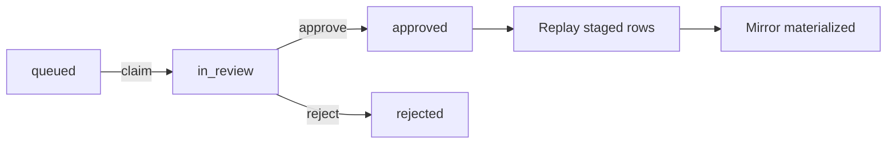

When a device sends SQLite data from a **new or changed table schema**, Golain queues a **schema review**. Until you approve, rows are **staged** — not queryable as product data.

## When a review appears

Typical triggers:

- **First batch** from a new `source_table` on a device (default policy → `ambiguous`)
- **Schema hash change** after migration (added column, type change, PK change)
- **Breaking** classification

You do **not** get a review for every batch — only when classification requires human column binding decisions.

## Prerequisites

- Permission **`PROJECT_CAN_MANAGE_DEVICES`** on the project
- platform-tui logged in with project context, or API bearer token
- Device lineages visible under **Edge Sync**

## Workflow overview



## Step 1 — Find the review

**platform-tui:**

1. Launch `platform-tui` with project context set.
2. Project menu → **Edge Sync** → **Schema Reviews**.
3. Look for status **`queued`** or **`in_review`**.

**HTTP:**

```bash
curl -s -H "Authorization: Bearer $TOKEN" -H "ORG-ID: $ORG_ID" \
  "$API/core/api/v1/projects/$PROJECT_ID/edge/schema-reviews?status=queued"
```

Note `review_id`, linked `lineage_id`, and `source_table`.

## Step 2 — Inspect staged data

Before approving, verify payload shape:

**TUI:** From review detail press **`d`** (staged rows for linked lineage).

**API:**

```bash
curl -s -H "Authorization: Bearer $TOKEN" -H "ORG-ID: $ORG_ID" \
  "$API/core/api/v1/projects/$PROJECT_ID/edge/lineages/$LINEAGE_ID/staged-rows?limit=20"
```

Confirm column names and types match expectations.

## Step 3 — Claim the review

Moves **`queued` → `in_review`**. Prevents another operator from conflicting edits.

**TUI:** Review detail → press **`c`**.

**API:**

```bash
curl -X POST -H "Authorization: Bearer $TOKEN" -H "ORG-ID: $ORG_ID" \
  -H "Idempotency-Key: claim-$REVIEW_ID" \
  "$API/core/api/v1/projects/$PROJECT_ID/edge/schema-reviews/$REVIEW_ID/claim" \
  -d '{"action_version": 1}'
```

Response includes current `action_version` — required for approve/reject.

## Step 4 — Decide column actions

For each source column, choose an action:

| Column type | Recommended action |
|-------------|-------------------|
| Primary key | `mirror` |
| Business data you need in SQL queries | `mirror` |
| Metric sample → existing datapoint | `map` with `device_data_point_id` |
| Internal / redundant | `ignore` |
| Unsure | `defer` (keeps lineage paused) |

Relational mirror example — all columns mirrored:

```json
{
  "action_version": 1,
  "column_actions": [
    { "source_column_name": "id", "action": "mirror", "mirror_column_name": "id" },
    { "source_column_name": "key", "action": "mirror", "mirror_column_name": "key" },
    { "source_column_name": "value", "action": "mirror", "mirror_column_name": "value" }
  ]
}
```

## Step 5 — Approve

**API (recommended for production):**

```bash
curl -X POST -H "Authorization: Bearer $TOKEN" -H "ORG-ID: $ORG_ID" \
  -H "Idempotency-Key: approve-$REVIEW_ID" \
  -H "Content-Type: application/json" \
  "$API/core/api/v1/projects/$PROJECT_ID/edge/schema-reviews/$REVIEW_ID/approve" \
  -d @column-actions.json
```

**TUI shortcut:** Press **`a`** — dev shortcut mirrors only the `value` column. **Do not use in production** for multi-column tables; use API with full `column_actions`.

### What happens on approve

1. Mirror table DDL created in Timescale (`edge_mirror_{device8}_{table}`).
2. Column bindings persisted.
3. Replay intent inserted — staged rows drain.
4. Lineage set **`active`** (if no deferred required columns).
5. Event: `integration.edge_schema_review.approved.v1`.

## Step 6 — Verify materialization

**TUI:** Lineage detail → **`w`** (written / mirror rows).

**API:**

```bash
curl -s -H "Authorization: Bearer $TOKEN" -H "ORG-ID: $ORG_ID" \
  "$API/core/api/v1/projects/$PROJECT_ID/edge/lineages/$LINEAGE_ID/mirror-rows?limit=50"
```

Live device writes should appear without new reviews until schema hash changes again.

## Rejecting a review

Use when schema is wrong or device sent garbage data:

**TUI:** **`x`** on review detail.

**API:**

```bash
curl -X POST .../edge/schema-reviews/$REVIEW_ID/reject \
  -H "Idempotency-Key: reject-$REVIEW_ID" \
  -d '{"action_version": 1, "reason": "Unexpected table from firmware v0.3"}'
```

Lineage stays **`paused`**. Staged rows remain until operator deletes lineage or schema fixed on device.

## Registry reviews (coalesced fleets)

When `schema_coalescing_mode` is `project` or `fleet`, first device may create a **registry review** instead of device-local only.

Use registry routes:

```
POST .../edge/registry-reviews/{id}/claim
POST .../edge/registry-reviews/{id}/approve
```

→ [Registry coalescing](/edge/data-sync/registry-coalescing)

## Tips

- Approve in **staging** before promoting device fleet-wide.
- Document `column_actions` in your runbook per firmware version.
- Use **`Idempotency-Key`** on every mutation — safe to retry on network blips.
- Watch event stream during approve for materialization failures.

## Related

- [Schema governance](/edge/data-sync/schema-governance)
- [platform-tui Edge Sync](/edge/data-sync/platform-tui-guide)
- [Troubleshooting approve failures](/edge/data-sync/troubleshooting)
