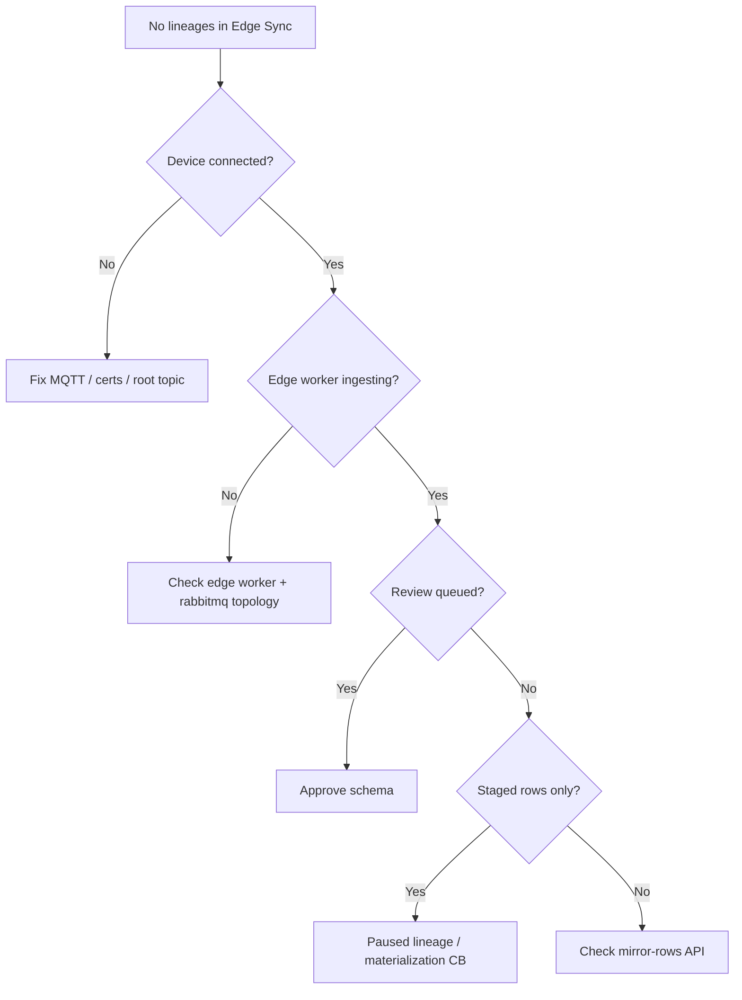

Structured troubleshooting for edge SQLite replication. Work top-down: connectivity → ingest → governance → materialization.

## Quick diagnostic tree



## Symptom index

| Symptom | Likely cause | Section |
|---------|--------------|---------|
| No lineages at all | MQTT not publishing sync topics | [Connectivity](#connectivity) |
| Device connected, still no lineages | Edge worker down or v1 topology | [Edge v2 cutover](#edge-v2-cutover) |
| Lineage paused, review queued | First schema / ambiguous change | [Schema review](#schema-review-issues) |
| Staged rows growing, no mirror | Not approved or materialization failing | [Materialization](#materialization) |
| Device stopped sending one table | `pause_lineage` downlink | [Backpressure](#backpressure-on-device) |
| Pre-seeded DB empty in cloud | No snapshot on first run | [Historical data](#historical-data-gaps) |
| State write-back 403/409 | Wrong authority or missing approve | [State write-back](#state-write-back) |
| Approve API 500 | Worker bug / binding order | [Approve failures](#approve-failures) |

---

## Edge v2 cutover

After upgrading to edge v2 (ilyama PR #283), batches route through **`edge_ingress_exchange`** and the **edge worker** — not the integration worker or legacy `telemetry.edge_export_segment` ingress.

### No lineages despite MQTT traffic

**Check:**

1. **Edge worker registered** — domain-workers logs should show `edge worker registered`. If `EDGE_WORKER_DISABLED=1`, unset it and restart.
2. **RabbitMQ topology synced** — run `make rabbitmq-topology` after upgrade. Queues must exist on `edge_ingress_exchange` (`edge_telemetry_ingest_stream`, `edge_state_ingest_queue`, `edge_meta_queue`).
3. **TSDB available** — edge worker requires Timescale for staging and mirror tables. Startup fails closed if TSDB pool is missing.
4. **Broker fan-in** — mqtt-broker must publish to `edge_ingress_exchange` (not integration exchange). Confirm broker version matches edge v2 hooks.

**Symptoms of stale topology:**

- MQTT connects; no lineages; no edge worker consume logs
- Broker logs show publish to unknown exchange or unrouted messages

### Downlink controls not reaching device

**Check:**

1. Edge worker stages **`EdgeIngestControlRequestedV2`** (domain `edge`, not `integration`).
2. `mqtt_broker_downlink_queue` binding includes `edge.ingest_control.requested.v1`.
3. Device subscribes to `{root}/sync/ingest/control` with persistent session (QoS 1).

### Telemetry vs row batches mixed up

| Topic | Expected pipeline |
|-------|-------------------|
| `sync/telemetry/batch` | Pipeline A — telemetry ingest stream |
| `sync/rows/batch` | Pipeline B — state ingest queue |

Publishing row journal data on the telemetry topic (or vice versa) causes validation rejects or empty lineages.

---

## Connectivity

### Device offline in console

**Check:**

- Broker URL reachable from device network
- mTLS cert not expired; CA matches broker
- `OMEGA_DEVICE_ID` equals registered **device name**
- Firewall allows MQTT TLS (8883) or QUIC UDP

```bash
golain devices get <name> --fleet=<fleet>
golain events list --source=mqtt --limit=20
```

### Connected but no lineages

**Check:**

- `OMEGA_ROOT_TOPIC` matches provisioned ACL (`{slug}/{name}` or `/{name}`)
- Omega module `sqlite-replication` in required modules
- `source.db` path correct; tables have PRIMARY KEY
- Journal receiving writes (restart Omega after app writes)

**Device logs:**

```bash
journalctl -u omega -f
# Look for sync/rows/batch or sync/telemetry/batch publish lines
```

### Batch rejected at broker/worker

Common rejection codes:

| Code | Fix |
|------|-----|
| `envelope_unstripped_tenant_fields` | Remove org/project/device_id from JSON payload |
| `invalid_batch_id` | Use UUIDv7 for batch_id |
| `batch_too_many_rows` | Split batch (< 4096 rows) |
| `duplicate_batch_seq` | Drop batch; advance telemetry cursor |
| `invalid_format_version` | Set `format_version: 1` |

→ [Limits and errors](/edge/data-sync/limits-dedup-errors)

---

## Schema review issues

### Review stuck in queued

- Another operator may need to claim — or claim yourself: **`c`** in TUI
- Confirm permission `PROJECT_CAN_MANAGE_DEVICES`

### Expected review on every new table

**Normal** with default policy. First batch from each `source_table` triggers **`ambiguous`** classification.

**Action:** [Schema review workflow](/edge/data-sync/schema-review-workflow)

### Device still sending during review

**Normal.** Cloud stages server-side for **both Pipeline A (telemetry) and Pipeline B (rows/batch)**. Device does **not** receive `pause_lineage` for review-only pause.

Verify staged rows increasing (**`d`** in TUI). Telemetry batches appear with `event_ts`; row batches show `commit_seq`.

### Schema hash mismatch after firmware update

Application migration changed DDL → new hash → new review.

**Action:** Claim review, inspect diff via staged payloads, approve new column actions or reject and fix firmware.

---

## Materialization

### Approved but mirror empty

**Checklist:**

1. Replay intent completed? — lineage detail in TUI
2. Materialization error count > 0? — use **`x`** reset after fixing root cause
3. Edge worker running with TSDB (not integration worker)
4. Column actions all `ignore`? — re-approve with `mirror` or `auto_create_and_map`

**API:**

```bash
GET .../edge/lineages/{id}/mirror-rows
GET .../edge/lineages/{id}/staged-rows   # should shrink after replay
```

### materialization_failed staging reason

Transient mirror DDL or write error. Rows staged with reason `materialization_failed` before circuit breaker confirms pause.

**Action:** Read error on lineage detail → fix TSDB/DDL → `POST .../reset-materialization`

### Live batches dropped after approve

Indicates missing live materialization path or edge worker not consuming the correct pipeline queue.

**Mitigation:** Confirm edge worker version includes live write paths for your pipeline; staged replay may still work for backlog.

---

## State write-back

### HTTP 403 `edge_state_not_cloud_authoritative`

The lineage sync authority is **device_authoritative**. Cloud write-back only works for tables approved as **cloud_authoritative**.

**Action:** Re-approve with the correct authority or use device-side journal updates instead.

### HTTP 404 / mirror not provisioned

Complete schema review before calling state write-back. Mirror/state DDL is provisioned on approve.

### Device never applies state_write downlink

**Check:**

1. Response includes `control_id` — track in `edge_pending_controls` until device ACKs
2. Device subscribed to `sync/ingest/control`
3. Omega version implements `state_write` control kind

→ [Downlink control](/edge/data-sync/downlink-control#state_write)

---

## Approve failures

### HTTP 500 on approve

Historical deployed bug: mirror binding upsert before `mirror_id` assigned.

**Symptoms:** Approve fails with internal error; review stays `in_review`.

**Action:** Deploy current edge worker from ilyama. Contact platform team if self-hosted on older build.

### HTTP 409 on TUI auto-approve

TUI **`a`** enables `allow_auto_create_device_data_points` via policy PATCH before approve. If policy PATCH returns 404 or approve returns 409, use the HTTP API with explicit `column_actions`.

**Action:** Refresh review (**`r`**) and retry, or approve via [API reference](/edge/data-sync/api-reference).

### defer columns block activation

If required columns use action **`defer`**, lineage stays paused after approve.

**Action:** Re-open review or submit amended approve with full mirror/map actions.

---

## Backpressure on device

### Device logs pause_lineage

**Cause:** Staged row cap (100k rows / 1 GiB default) or materialization circuit breaker.

**Device behavior:** Must ACK, stop publishing that table, buffer locally.

**Operator:**

- Inspect staged volume — approve pending reviews to drain
- Wait for auto-resume below 80% threshold
- Do **not** expect TUI **`x`** to fix volume pause

### Device logs resume_lineage

Device should drain buffer from `server_watermark + 1`. If sync stalls after resume, check `state.db` integrity.

### Buffer lost during long pause

If local retention exceeded, incremental sync may gap.

**Future:** bootstrap snapshot via secondary flow. **Today:** re-mutate rows on device or delete lineage and re-enroll.

---

## Historical data gaps

### Rows existed before Omega start

`snapshot_on_first_run` **not implemented**. Triggers only capture writes after module install.

**Workarounds:**

- Run UPDATE touching all rows after Omega start
- Re-insert seed data after Omega running
- Wait for bootstrap snapshot support

### Omega was down during app writes

Journal accumulates while Omega offline (triggers still fire). On restart, flush catches up — verify `commit_seq` advances in staged/mirror data.

---

## Identity mismatches

| Mistake | Effect |
|---------|--------|
| Filter API by MQTT **name** instead of UUID | Empty query results |
| `OMEGA_DEVICE_ID` ≠ registered name | Wrong topic / no ingest |
| JITR device_name mismatch | Enrollment failure |
| State write `table_id` ≠ lineage UUID | 404 / bad request |

Use `golain devices get` for UUID vs name. Use lineage ID from Edge Sync for state write-back.

---

## Registry / coalescing issues

| Symptom | Check |
|---------|-------|
| Device auto-approved unexpectedly | Registry already approved same hash |
| Wrong mirror table | Coalescing mode project vs fleet |
| Device review + registry review both exist | Coalescing migration period — use registry approve |

→ [Registry coalescing](/edge/data-sync/registry-coalescing)

---

## platform-tui-specific

| Issue | Note |
|-------|------|
| **`a` approve auto-maps from registry schema** | PK columns → mirror; timestamp columns → ignore; others → auto_create_and_map |
| **`f` cycles review filter** | All / Queued / In Review / Approved / Rejected / Abandoned |
| **`v` from lineage detail** | Jump to schema review when lineage paused |
| Registry reviews in TUI | Uses registry review API — approve via HTTP for bespoke column actions |
| Written view falls back to QueryScript | When mirror-rows 404, TUI queries telemetry by device |

---

## Escalation data package

When filing an issue, include:

```bash
# Redact secrets
golain --output=json devices get <name> --fleet=<fleet>
golain --output=json events list --source=mqtt --limit=50

# Lineage + review IDs from TUI or API
# Edge worker version / git SHA if self-hosted
# Confirm make rabbitmq-topology applied after upgrade
# omega -version
# Sample staged row JSON (one row)
```

---

## Related

- [How it works](/edge/data-sync/how-it-works)
- [Backpressure](/edge/data-sync/backpressure)
- [Schema review workflow](/edge/data-sync/schema-review-workflow)
- [Omega runbook (source)](https://github.com/golain-io/omega/blob/main/docs/sqlite-replication-status-and-runbook.md)
