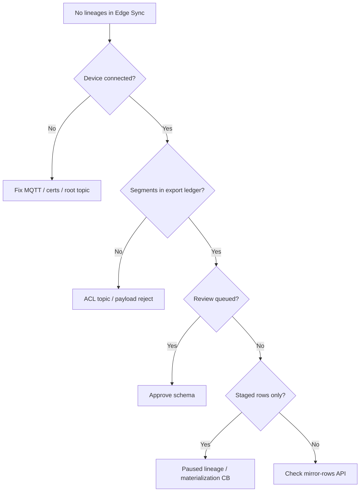

Structured troubleshooting for edge SQLite replication. Work top-down: connectivity → ingest → governance → materialization.

## Quick diagnostic tree



## Symptom index

| Symptom | Likely cause | Section |
|---------|--------------|---------|
| No lineages at all | MQTT not publishing sync topics | [Connectivity](#connectivity) |
| Lineage paused, review queued | First schema / ambiguous change | [Schema review](#schema-review-issues) |
| Staged rows growing, no mirror | Not approved or materialization failing | [Materialization](#materialization) |
| Device stopped sending one table | `pause_lineage` downlink | [Backpressure](#backpressure-on-device) |
| Pre-seeded DB empty in cloud | No snapshot on first run | [Historical data](#historical-data-gaps) |
| Approve API 500 | Worker bug / binding order | [Approve failures](#approve-failures) |

---

## Connectivity

### Device offline in console

**Check:**

- Broker URL reachable from device network
- mTLS cert not expired; CA matches broker
- `OMEGA_DEVICE_ID` equals registered **device name**
- Firewall allows MQTT TLS (8883) or QUIC UDP

```bash
platform-tui devices get <name> --fleet=<fleet>
platform-tui events list --source=mqtt --limit=20
```

### Connected but no lineages

**Check:**

- `OMEGA_ROOT_TOPIC` matches provisioned ACL (`{slug}/{name}` or `/{name}`)
- Omega module `sqlite-replication` in required modules
- `source.db` path correct; tables have PRIMARY KEY
- Journal receiving writes (restart Omega after app writes)

**Device logs:**

```bash
journalctl -u omega -f
# Look for sync/rows/batch publish lines
```

### Batch rejected at broker/worker

Common rejection codes:

| Code | Fix |
|------|-----|
| `envelope_unstripped_tenant_fields` | Remove org/project/device_id from JSON payload |
| `invalid_batch_id` | Use UUIDv7 for batch_id |
| `batch_too_many_rows` | Split batch (< 4096 rows) |
| `duplicate_batch_seq` | Drop batch; advance telemetry cursor |
| `invalid_format_version` | Set `format_version: 1` |

→ [Limits and errors](/edge/data-sync/limits-dedup-errors)

---

## Schema review issues

### Review stuck in queued

- Another operator may need to claim — or claim yourself: **`c`** in TUI
- Confirm permission `PROJECT_CAN_MANAGE_DEVICES`

### Expected review on every new table

**Normal** with default policy. First batch from each `source_table` triggers **`ambiguous`** classification.

**Action:** [Schema review workflow](/edge/data-sync/schema-review-workflow)

### Device still sending during review

**Normal.** Cloud stages server-side. Device does **not** receive `pause_lineage` for review-only pause.

Verify staged rows increasing (**`d`** in TUI).

### Schema hash mismatch after firmware update

Application migration changed DDL → new hash → new review.

**Action:** Claim review, inspect diff via staged payloads, approve new column actions or reject and fix firmware.

---

## Materialization

### Approved but mirror empty

**Checklist:**

1. Replay intent completed? — lineage detail in TUI
2. Materialization error count > 0? — use **`x`** reset after fixing root cause
3. Worker version includes live materialization fix (deployed stack may lag)
4. Column actions all `ignore`? — re-approve with `mirror`

**API:**

```bash
GET .../edge/lineages/{id}/mirror-rows
GET .../edge/lineages/{id}/staged-rows   # should shrink after replay
```

### materialization_failed staging reason

Transient mirror DDL or write error. Rows staged with reason `materialization_failed` before circuit breaker confirms pause.

**Action:** Read error on lineage detail → fix TSDB/DDL → `POST .../reset-materialization`

### Live batches dropped after approve

Indicates missing **live materialization path** on worker — rows accepted to ledger but not written to mirror for **active** lineage.

**Mitigation:** Ensure deployed worker includes `edge_mirror.go` live write path; staged replay may still work for backlog.

---

## Approve failures

### HTTP 500 on approve

Historical deployed bug: mirror binding upsert before `mirror_id` assigned.

**Symptoms:** Approve fails with internal error; review stays `in_review`.

**Action:** Deploy worker fix from ilyama `edge_review_rpc.go` (provision mirror before binding upsert). Contact platform team if self-hosted on older build.

### defer columns block activation

If required columns use action **`defer`**, lineage stays paused after approve.

**Action:** Re-open review or submit amended approve with full mirror/map actions.

---

## Backpressure on device

### Device logs pause_lineage

**Cause:** Staged row cap (100k rows / 1 GiB default) or materialization circuit breaker.

**Device behavior:** Must ACK, stop publishing that table, buffer locally.

**Operator:**

- Inspect staged volume — approve pending reviews to drain
- Wait for auto-resume below 80% threshold
- Do **not** expect TUI **`x`** to fix volume pause

### Device logs resume_lineage

Device should drain buffer from `server_watermark + 1`. If sync stalls after resume, check `state.db` integrity.

### Buffer lost during long pause

If local retention exceeded, incremental sync may gap.

**Future:** bootstrap snapshot via secondary flow. **Today:** re-mutate rows on device or delete lineage and re-enroll.

---

## Historical data gaps

### Rows existed before Omega start

`snapshot_on_first_run` **not implemented**. Triggers only capture writes after module install.

**Workarounds:**

- Run UPDATE touching all rows after Omega start
- Re-insert seed data after Omega running
- Wait for bootstrap snapshot support

### Omega was down during app writes

Journal accumulates while Omega offline (triggers still fire). On restart, flush catches up — verify `commit_seq` advances in staged/mirror data.

---

## Identity mismatches

| Mistake | Effect |
|---------|--------|
| Filter API by MQTT **name** instead of UUID | Empty query results |
| `OMEGA_DEVICE_ID` ≠ registered name | Wrong topic / no ingest |
| JITR device_name mismatch | Enrollment failure |

Use `platform-tui devices get` for UUID vs name.

---

## Registry / coalescing issues

| Symptom | Check |
|---------|-------|
| Device auto-approved unexpectedly | Registry already approved same hash |
| Wrong mirror table | Coalescing mode project vs fleet |
| Device review + registry review both exist | Coalescing migration period — use registry approve |

→ [Registry coalescing](/edge/data-sync/registry-coalescing)

---

## platform-tui-specific

| Issue | Note |
|-------|------|
| **`a` approve only mirrors `value`** | Use API for multi-column tables |
| No registry UI | Use HTTP routes |
| Written view 404 | Mirror not provisioned — complete approve first |

---

## Escalation data package

When filing an issue, include:

```bash
# Redact secrets
platform-tui --output=json devices get <name> --fleet=<fleet>
platform-tui --output=json events list --source=mqtt --limit=50

# Lineage + review IDs from TUI or API
# Worker version / git SHA if self-hosted
# omega -version
# Sample staged row JSON (one row)
```

---

## Related

- [How it works](/edge/data-sync/how-it-works)
- [Backpressure](/edge/data-sync/backpressure)
- [Schema review workflow](/edge/data-sync/schema-review-workflow)
- [Omega runbook (source)](https://github.com/golain-io/omega/blob/main/docs/sqlite-replication-status-and-runbook.md)
