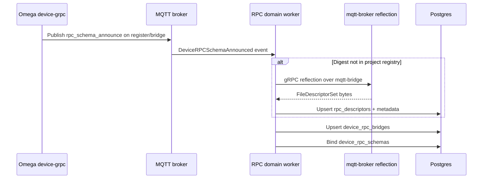
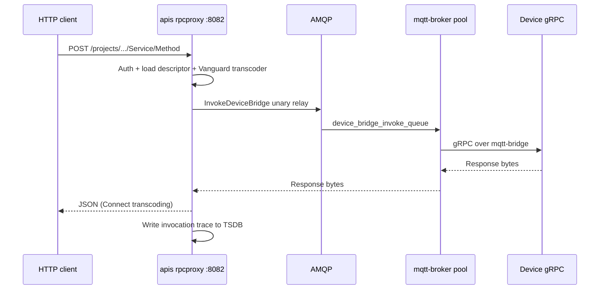

Device gRPC RPC has two pipelines: **registration** (runs when a device connects or its schema changes) and **invoke** (runs on every method call). Registration is heavier — it may reflect the full protobuf descriptor from the device. Invoke stays on a hot path using cached descriptors and pooled bridge connections.

## Registration (cold path)

When the device's gRPC bridge comes up, it announces itself. The platform registers the schema if needed and binds it to the device.



### Step by step

1. **Device announce** — On connect (and reconnect), Omega publishes JSON on `{rootTopic}/register/bridge`:

   ```json
   {
     "action": "rpc_schema_announce",
     "data": {
       "bridge_id": "<bridge_id>",
       "descriptor_digest": "sha256:<hex>",
       "bridge_type": "grpc"
     }
   }
   ```

   When `signed_control.enabled: true`, the payload is wrapped in the standard Omega signed control envelope.

2. **Broker ingest** — The MQTT broker hook parses the announce and emits a `DeviceRPCSchemaAnnounced` event to the RPC domain worker.

3. **Digest lookup** — If the digest already exists in the **project descriptor registry**, the platform skips re-reflecting from the device.

4. **Reflection** — On digest miss, the platform dials the device over mqtt-bridge and runs **gRPC server reflection** to collect the `FileDescriptorSet`. The descriptor is content-addressed (`sha256:…`) and stored in Postgres with parsed service/method metadata.

5. **Bridge registration** — `device_rpc_bridges` records the active `bridge_id` and `last_seen_at` so the mqtt-broker pool knows how to dial the device.

6. **Schema binding** — `device_rpc_schemas` links the device to its descriptor. If the digest is unchanged, rebind is skipped.

### Fast paths

| Condition | Platform behavior |
|-----------|-------------------|
| Digest already in project registry | Skip device reflection; register/bind only |
| Device binding digest unchanged | Skip rebind |
| Manual `POST .../rpc/reflect` with cached digest | Skip device reflection when digest matches cache |

## Invoke (hot path)

Every cloud invoke follows the same relay path. The platform does not re-reflect on invoke — it uses the bound descriptor bytes cached in apis.



### Step by step

1. **HTTP request** — Client POSTs to:

   ```
   https://{api-host}:8082/projects/{project_id}/devices/{device_id}/{full.service.Name}/{Method}
   ```

2. **Auth middleware** — Validates `Authorization: Bearer` token, `ORG-ID` header, and `can_invoke_rpc` permission on the device (single scoped DB check).

3. **Descriptor resolution** — Loads the device's bound descriptor bytes from Postgres (with a short TTL cache). Parses the target service and method; rejects streaming methods with `501`.

4. **Transcoding** — **Vanguard** converts Connect JSON request bodies to protobuf bytes using the cached `ServiceDescriptor`. No hand-rolled dynamic protobuf on the hot path.

5. **Relay** — apis publishes an AMQP invoke command. mqtt-broker picks it up, gets or creates a pooled gRPC client over mqtt-bridge, and calls the device method with raw byte passthrough.

6. **Response** — Protobuf response bytes flow back through the same chain; Vanguard transcodes to JSON for the HTTP client.

7. **Audit trace** — One row is written to the project-scoped `rpc_invocations_*` Timescale hypertable: latency, gRPC status, service/method names, and **SHA-256 digests** of request/response — never raw payloads.

Optional `?session_id=` on the invoke URL groups traces for later queries via the management API.

## MQTT bridge wire protocol

Between cloud dialer and device listener, **mqtt-bridge** frames gRPC over MQTT:

| Topic pattern | Direction | Purpose |
|---------------|-----------|---------|
| `{rootTopic}/register/bridge` | Device → cloud | Schema announce |
| `{rootTopic}/bridge/{bridge_id}/handshake/request/{client_id}` | Cloud → device | Session handshake |
| `{rootTopic}/bridge/{bridge_id}/handshake/response/{client_id}` | Device → cloud | Handshake reply |
| `{rootTopic}/bridge/{bridge_id}/session/{session_id}/up` | Device → cloud | gRPC frames upstream |
| `{rootTopic}/bridge/{bridge_id}/session/{session_id}/down` | Cloud → device | gRPC frames downstream |

QoS defaults to **2** on the `device-grpc` module for reliable delivery.

## Root topic resolution

The cloud must dial the same MQTT topic tree the device listens on. Dial info is resolved from platform data:

- **`bridge_id`** — from the device's schema announce (stored in `device_rpc_bridges`)
- **`device_name`** — the device's registered name
- **`topic_slug`** — project/fleet topic prefix from device registration

The effective root topic is `/{topic_slug}/{device_name}` when `topic_slug` is set, otherwise just `{device_name}`.

Your Omega `connection.root_topic` (or scaffolded `OMEGA_ROOT_TOPIC`) must match what the platform expects. A mismatch produces "no active bridge" or dial failures even when MQTT is connected.

## Unary-only from cloud

The reference **EchoService** in Omega implements unary, client-stream, server-stream, and bidi-stream methods. The cloud invoke proxy supports **unary methods only** today. Calling a streaming method returns `501 streaming rpc not supported`.

Device-side streaming over mqtt-bridge still works for local or custom tooling; only the `:8082` cloud entrypoint is limited.

## Related

- [Omega setup](/edge/device-rpc/omega-setup) — enable the module and verify announce
- [Invoking methods](/edge/device-rpc/invoking-methods) — HTTP caller guide
- [Troubleshooting](/edge/device-rpc/troubleshooting) — when registration or invoke fails
