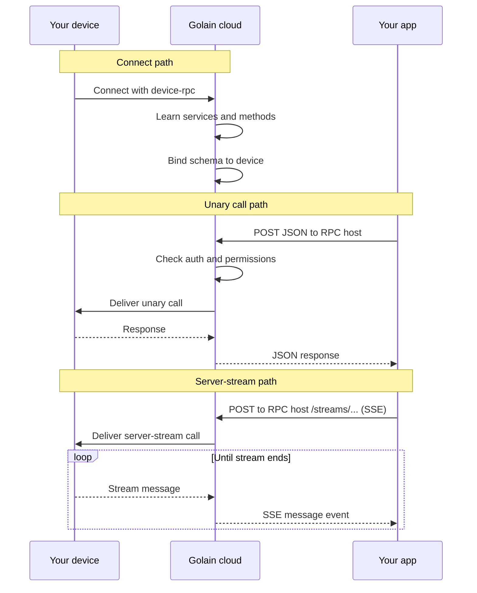

Device RPC boils down to two moments: **when your device connects** (Golain learns what it can call) and **when you call a method** (Golain delivers your request and returns JSON or a stream).

## When your device connects

1. Omega starts the `device-rpc` module and connects to Golain over MQTT.
2. Golain learns which gRPC services and methods the device exposes (for example `golain.device.v1.EchoService` with methods `Echo` and `EchoServerStream`).
3. Golain stores the schema for your project and binds it to this device.
4. The device is **ready to call** — list services from the management API or invoke directly.

If the device disconnects and reconnects, Golain refreshes the binding. When the service schema changes, Golain picks up the new descriptor on the next connect.

## When you call a method

### Unary (sync invoke)

1. Your app sends an HTTP POST with a JSON body to the **RPC host** (`https://rpc.ilyama.golain.io`) — `/{Service}/{Method}` in the URL, no `/core/api/v1` prefix.
2. Golain checks your token, organization, and `can_invoke_rpc` permission on the device.
3. Golain delivers the call to the device and waits for the handler to finish.
4. Golain converts the response to JSON and returns it to your app.

Optional `?session_id=` on the invoke URL groups calls for later audit queries. See [Invoking methods](/edge/device-rpc/invoking-methods) for headers, URL shape, and examples.

### Server-stream (SSE)

1. Your app POSTs to the **RPC host** with `/streams/{Service}/{Method}` in the URL and `Accept: text/event-stream`.
2. Golain checks auth and permissions the same way as unary invoke.
3. Golain opens a server-streaming call to the device and relays each response message as an SSE `message` event (base64 protobuf).
4. The stream ends with an `end` event, or `error` / `cancelled` on failure.

Use `curl -N` so the client does not buffer events. See [Stream a method (SSE)](/edge/device-rpc/invoking-methods#stream-a-method-sse).

<Note>
  Your device's MQTT **root topic** and **device name** must match what you registered in the Console. A mismatch causes invoke or schema errors even when MQTT looks healthy. See [Omega setup](/edge/device-rpc/omega-setup).
</Note>

## Cloud invoke by method type

| Method type | Cloud path | Notes |
|-------------|------------|-------|
| **Unary** | `POST https://rpc.ilyama.golain.io/.../{Service}/{Method}` | Connect JSON request and response |
| **Server stream** | `POST https://rpc.ilyama.golain.io/.../streams/{Service}/{Method}` | SSE (`text/event-stream`) |
| **Client stream** | — | Device only — sync path returns **501** `streaming rpc not supported` |
| **Bidi stream** | — | Device only — sync path returns **501** `streaming rpc not supported` |

The bundled echo example includes all four shapes. From the cloud, call `Echo` (unary) or `EchoServerStream` (server-stream). `EchoClientStream` and `EchoBidiStream` are for device-local testing.

## Queued calls

When the device may be offline, use the **enqueue** path instead of a blocking invoke. Golain stores the request and delivers it when the device is available; you poll for the result. **Queued invoke is unary-only** — there is no enqueue path for streams. Delivery is **at-least-once**, so handlers should be idempotent. See [Queued invoke](/edge/device-rpc/queued-invoke) for enqueue, poll, and retry behavior.

## Related

- [Overview](/edge/device-rpc/overview) — concepts and prerequisites
- [Omega setup](/edge/device-rpc/omega-setup) — enable device-rpc and verify connect
- [Invoking methods](/edge/device-rpc/invoking-methods) — HTTP caller guide
- [Queued invoke](/edge/device-rpc/queued-invoke) — offline delivery
- [Troubleshooting](/edge/device-rpc/troubleshooting) — when connect or invoke fails
