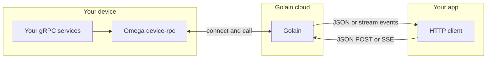

**Device RPC** lets you call typed methods on services running on your edge device — from the Golain cloud, using normal HTTP requests with JSON bodies. You write real gRPC handlers on the device; Golain handles authentication, routing, and JSON conversion so your app does not need gRPC or MQTT libraries.

This is different from legacy [shell RPC](/edge/remote-control), which runs allowlisted shell commands over signed control topics (`exec:<command>`). Device RPC is for protobuf services with a discoverable schema, audit trails, and typed request/response shapes.

## Who this is for

| Role | Start here |
|------|------------|
| Edge engineer shipping Omega | [Omega setup](/edge/device-rpc/omega-setup) → [How it works](/edge/device-rpc/how-it-works) → [Invoking methods](/edge/device-rpc/invoking-methods) |
| Integrator / backend developer | [Invoking methods](/edge/device-rpc/invoking-methods) → [Queued invoke](/edge/device-rpc/queued-invoke) → [API reference](/edge/device-rpc/api-reference) |
| Frontend / TypeScript app builder | [TypeScript frontend](/edge/device-rpc/typescript-frontend) → [Invoking methods](/edge/device-rpc/invoking-methods) → [Queued invoke](/edge/device-rpc/queued-invoke) |
| Fleet operator / platform admin | [How it works](/edge/device-rpc/how-it-works) → [Troubleshooting](/edge/device-rpc/troubleshooting) |

## At a glance

## Core concepts

<CardGroup cols={2}>
  <Card title="Schema" icon="file-code" href="/edge/device-rpc/how-it-works">
    When your device connects, Golain learns which gRPC services and methods it exposes. You can list them from the management API — no manual proto upload.
  </Card>
  <Card title="Unary invoke" icon="bolt" href="/edge/device-rpc/invoking-methods">
    Call a method synchronously: POST JSON to the **RPC host** (`https://rpc.ilyama.golain.io`) with `{Service}/{Method}` in the URL. Golain delivers the call to the device and returns Connect JSON.
  </Card>
  <Card title="Server stream" icon="wave-square" href="/edge/device-rpc/invoking-methods#stream-a-method-sse">
    Stream server-streaming methods over SSE: POST to `https://rpc.ilyama.golain.io/.../streams/{Service}/{Method}` with `Accept: text/event-stream`. Each event carries a base64 protobuf message.
  </Card>
  <Card title="Queued invoke" icon="clock" href="/edge/device-rpc/queued-invoke">
    Enqueue a unary call when the device may be offline. Poll until the call succeeds. Delivery is at-least-once — design handlers to be safe on retry.
  </Card>
</CardGroup>

## Prerequisites

Before you invoke methods from the cloud, confirm:

1. **Device registered** in the Console or via platform-tui — you need the device UUID.
2. **Omega with `device-rpc`** enabled and deployed on the device — see [Omega setup](/edge/device-rpc/omega-setup).
3. **Device online** on MQTT so Golain can learn its service schema.
4. **Caller permission** — your user needs `can_invoke_rpc` on the target device.

<Warning>
  Invoke, stream, and enqueue requests go to the **RPC host** (`https://rpc.ilyama.golain.io`) — paths like `/projects/.../devices/...` with no `/core/api/v1` prefix. Management routes (list services, reflect, audit) use `https://api.ilyama.golain.io/core/api/v1/...`.
</Warning>

<Note>
  Device RPC is separate from [legacy shell RPC](/edge/remote-control). Use Device RPC when you need typed protobuf services; use shell RPC for simple command execution.
</Note>

## Typical first-time flow

1. **Enable `device-rpc`** in Omega and deploy the device → [Omega setup](/edge/device-rpc/omega-setup).
2. **Confirm services** — list available methods via the management API (for example `golain.device.v1.EchoService` / `Echo`).
3. **Invoke a method** — POST JSON to the RPC host → [Invoking methods](/edge/device-rpc/invoking-methods). For server-streaming methods, use the `/streams/` path. For offline-tolerant delivery, use [Queued invoke](/edge/device-rpc/queued-invoke).
4. **Review audit** — optional `?session_id=` on invoke groups traces you can query later.

## Next steps

- [How it works](/edge/device-rpc/how-it-works) — what happens when a device connects and when you call a method
- [Omega setup](/edge/device-rpc/omega-setup) — enable the module and run the echo example
- [Invoking methods](/edge/device-rpc/invoking-methods) — curl, headers, unary invoke, and SSE streaming
- [Queued invoke](/edge/device-rpc/queued-invoke) — offline delivery, polling, and idempotency
- [TypeScript frontend](/edge/device-rpc/typescript-frontend) — `fetch` snippets for custom UIs
- [API reference](/edge/device-rpc/api-reference) — management endpoints
- [Troubleshooting](/edge/device-rpc/troubleshooting) — common errors and fixes
