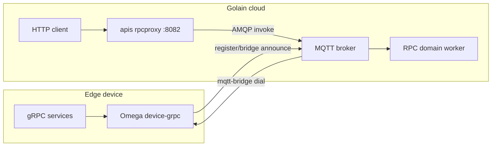

**Device gRPC RPC** lets you invoke protobuf/gRPC services running on an edge device from the Golain cloud — using a normal HTTP API with JSON bodies. The device exposes real gRPC handlers; the platform tunnels calls over MQTT via **mqtt-bridge**, registers the service schema automatically, and transcodes Connect JSON on the way in and out.

This is not the legacy [shell RPC](/edge/remote-control) path (`exec:<command>` over signed control topics). Device gRPC RPC is for typed, schema-aware method calls with audit trails and descriptor governance.

## Who this is for

| Role | Start here |
|------|------------|
| Fleet operator / platform admin | [How it works](/edge/device-rpc/how-it-works) → [Troubleshooting](/edge/device-rpc/troubleshooting) |
| Edge engineer shipping Omega | [Omega setup](/edge/device-rpc/omega-setup) → [How it works](/edge/device-rpc/how-it-works) |
| Integrator / backend developer | [Invoking methods](/edge/device-rpc/invoking-methods) → [API reference](/edge/device-rpc/api-reference) |

## At a glance

## Core concepts

<CardGroup cols={2}>
  <Card title="Schema announce" icon="bullhorn" href="/edge/device-rpc/how-it-works#registration-cold-path">
    Device publishes `rpc_schema_announce` when its gRPC bridge is up. The platform learns the bridge ID and descriptor digest.
  </Card>
  <Card title="Reflection" icon="mirror" href="/edge/device-rpc/how-it-works#registration-cold-path">
    On first sight of a new digest, the platform reflects gRPC services from the device and stores the descriptor in the project registry.
  </Card>
  <Card title="Schema binding" icon="link" href="/edge/device-rpc/how-it-works#registration-cold-path">
    Each device is bound to one descriptor digest. Invoke uses the bound schema for transcoding.
  </Card>
  <Card title="Unary invoke" icon="bolt" href="/edge/device-rpc/invoking-methods">
    Cloud callers POST to port **8082** with `{Service}/{Method}` in the URL. Streaming RPCs are not supported from cloud yet.
  </Card>
</CardGroup>

## Components

| Piece | Repository | Role |
|-------|------------|------|
| **Omega** `device-grpc` module | [golain-io/omega](https://github.com/golain-io/omega) | Runs gRPC server over mqtt-bridge; publishes schema announce on connect |
| **mqtt-bridge** | [golain-io/mqtt-bridge](https://github.com/golain-io/mqtt-bridge) | Tunnels gRPC frames over MQTT handshake/session topics |
| **MQTT broker** | [golain-io/ilyama](https://github.com/golain-io/ilyama) | Ingests announce; pools bridge connections for invoke |
| **RPC domain worker** | ilyama | Reflects schema, registers descriptors, binds devices |
| **apis rpcproxy** (`:8082`) | ilyama | HTTP Connect transcoding + auth; relays unary calls to device |

Reference profile: [`omega/profiles/rpc-example.yaml`](https://github.com/golain-io/omega/blob/main/profiles/rpc-example.yaml).

## Prerequisites

Before invoking methods from the cloud:

1. **Device registered** in console or CLI — note device UUID and MQTT root topic.
2. **Device online** on MQTT with the `device-grpc` module enabled.
3. **Schema announce processed** — device publishes on `{rootTopic}/register/bridge`; platform binds a descriptor (see [Omega setup](/edge/device-rpc/omega-setup)).
4. **Caller permission** — your user needs `can_invoke_rpc` on the target device.
5. **Topology current** — after upgrading to Device RPC, run `make rabbitmq-topology` on the platform so `device_bridge_*` queues exist.

<Warning>
  Invoke requests go to port **8082** on the API host, not the main Fiber API port. Management routes (list services, reflect, audit) use `/core/api/v1/...` on the standard API port.
</Warning>

<Note>
  Device gRPC RPC is separate from [legacy shell RPC](/edge/remote-control) (`reflection/control/request` + allowlisted shell commands). Use Device gRPC RPC when you need typed protobuf services; use shell RPC for simple command execution.
</Note>

## Typical first-time flow

1. **Enable `device-grpc`** in Omega client YAML and deploy the device → [Omega setup](/edge/device-rpc/omega-setup).
2. **Confirm schema** — `GET /core/api/v1/projects/{project_id}/devices/{device_id}/rpc/services` returns services and `descriptor_digest`.
3. **Invoke a method** — `POST` to `:8082/projects/{project_id}/devices/{device_id}/{Service}/{Method}` → [Invoking methods](/edge/device-rpc/invoking-methods).
4. **Audit** — pass `?session_id=` on invoke; query invocation history via the management API.

## Next steps

- [How it works](/edge/device-rpc/how-it-works) — registration and invoke pipelines in detail
- [Omega setup](/edge/device-rpc/omega-setup) — profile YAML, local mosquitto quickstart, echo example
- [Invoking methods](/edge/device-rpc/invoking-methods) — curl, headers, permissions
- [API reference](/edge/device-rpc/api-reference) — management endpoints and response shapes
- [Troubleshooting](/edge/device-rpc/troubleshooting) — common errors and fixes
