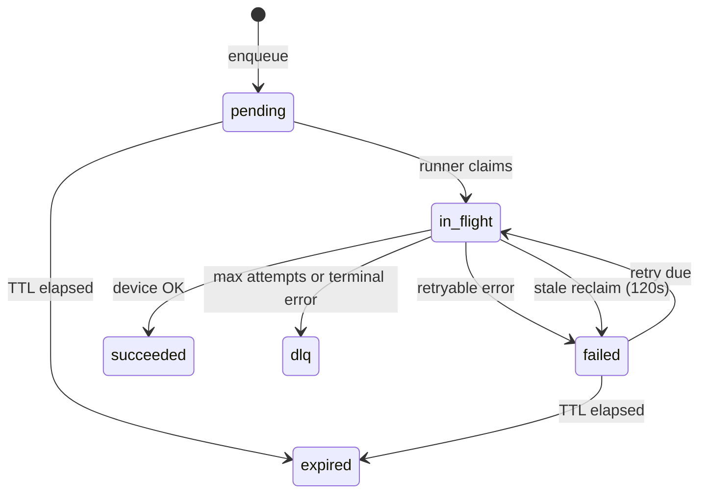

**Queued invoke** persists a unary device gRPC call in Postgres and delivers it when the device is reachable. Use it when the device may be offline, when you want the platform to retry transient failures, or when your integration prefers enqueue-and-poll over holding an HTTP connection open.

Synchronous invoke (no `enqueue/` prefix) blocks until the device responds or the proxy times out. Queued invoke returns immediately with a `call_id` you poll until the call reaches a terminal state.

<Warning>
  **Queued RPC is at-least-once delivery.** The platform may invoke the same logical call on the device more than once — for example when the device succeeds but the platform fails to mark the row `succeeded`, or when a stale `in_flight` row is reclaimed after **120 seconds** and retried.

  **Your device handlers must implement idempotency.** The platform does not forward `call_id` to the device today. Design protobuf request messages with an explicit idempotency key, or make handlers safe to run multiple times with the same payload.
</Warning>

## When to use queued vs sync invoke

| | Sync invoke | Queued invoke |
|---|-------------|---------------|
| **URL** | `:8082/.../devices/{id}/{Service}/{Method}` | `:8082/.../devices/{id}/enqueue/{Service}/{Method}` |
| **Device must be online** | Yes — call blocks until response or timeout | No — call is stored and delivered later |
| **HTTP response** | Method response JSON (Connect) | `202 Accepted` with `call_id`, `state`, `expires_at` |
| **Retries** | Caller retries on failure | Platform retries up to **5** attempts (default) with backoff |
| **Result retrieval** | In the invoke response body | Poll `GET .../rpc/queued/{call_id}` |
| **Delivery guarantee** | Best-effort single attempt | **At-least-once** — device may see duplicates |

For online devices and low-latency control paths, prefer [sync invoke](/edge/device-rpc/invoking-methods). Use queued invoke for offline-tolerant workflows, batch jobs, and integrations that already poll for completion.

## Enqueue a call

```
POST https://{api-host}:8082/projects/{project_id}/devices/{device_id}/enqueue/{Service}/{Method}
```

**Optional query:** `?ttl_seconds={n}` — how long the platform keeps trying before marking the call `expired`.

| `ttl_seconds` | Behavior |
|---------------|----------|
| Omitted or `0` | Defaults to **900** seconds (15 minutes) |
| Below 60 | Clamped to **60** seconds |
| Above 86400 | Clamped to **86400** seconds (24 hours) |

### Required headers

| Header | Value |
|--------|-------|
| `Authorization` | `Bearer {oidc_access_token}` |
| `ORG-ID` | Organization UUID |
| `Content-Type` | `application/json` |
| `Connect-Protocol-Version` | `1` |
| `Idempotency-Key` | **Recommended** — unique per logical enqueue; reuse only when retrying the **same** request body |

### Example

```bash
IDEM_KEY=$(uuidgen)

curl -sS -X POST \
  "https://api.ilyama.golain.io:8082/projects/$PROJECT_ID/devices/$DEVICE_ID/enqueue/golain.device.v1.EchoService/Echo?ttl_seconds=900" \
  -H "Authorization: Bearer $TOKEN" \
  -H "ORG-ID: $ORG_ID" \
  -H "Content-Type: application/json" \
  -H "Connect-Protocol-Version: 1" \
  -H "Idempotency-Key: $IDEM_KEY" \
  -d '{"message":"hello when online"}'
```

**Response** (`202 Accepted`):

```json
{
  "ok": true,
  "data": {
    "call_id": "550e8400-e29b-41d4-a716-446655440000",
    "state": "pending",
    "expires_at": "2026-07-07T10:30:00.000000000Z"
  }
}
```

Save `call_id` for polling. The request body is stored as protobuf bytes after Connect JSON transcoding — same schema rules as [sync invoke](/edge/device-rpc/invoking-methods).

### Enqueue idempotency (HTTP layer)

Send `Idempotency-Key` when enqueueing so network retries return the same `call_id` instead of creating duplicate rows.

<Warning>
  Enqueue dedupe keys on metadata (device, service, method, TTL, request **length**) — not a hash of the request body. Two enqueues with the **same** `Idempotency-Key` but **different** JSON bodies can return the first call's cached response. Use a fresh key for every distinct operation; reuse a key only when retrying an identical enqueue.
</Warning>

If a duplicate enqueue is still in progress, the API returns **409 Conflict** (`request already in progress`).

## Poll call status

```
GET /core/api/v1/projects/{project_id}/devices/{device_id}/rpc/queued/{call_id}
```

Uses the standard API port (not `:8082`). Requires `can_invoke_rpc` on the device.

```bash
curl -sS \
  -H "Authorization: Bearer $TOKEN" \
  -H "ORG-ID: $ORG_ID" \
  "$API/core/api/v1/projects/$PROJECT_ID/devices/$DEVICE_ID/rpc/queued/$CALL_ID"
```

**Response `data` fields:**

| Field | When present | Description |
|-------|--------------|-------------|
| `call_id` | Always | UUID of the queued call |
| `state` | Always | Current lifecycle state (see below) |
| `service_name`, `method_name` | Always | Target gRPC method |
| `attempts` | Always | Delivery attempts so far |
| `created_at`, `updated_at` | Always | Row timestamps |
| `expires_at` | When set | TTL deadline |
| `next_attempt_at` | When scheduled | Next platform retry time (`failed` state) |
| `grpc_status_code`, `grpc_message` | After device response | gRPC status from the device |
| `response` | On `succeeded` | **Base64-encoded** protobuf response bytes |
| `last_error` | On failure paths | Platform or bridge error text |

Decode `response` with your protobuf response type (or Connect JSON transcoding client) after base64 decode.

### Call states



| State | Meaning |
|-------|---------|
| `pending` | Waiting for first delivery attempt |
| `in_flight` | Platform is invoking the device now |
| `failed` | Attempt failed; will retry if `expires_at` not passed and attempts remain |
| `succeeded` | Device returned a response; `response` field populated |
| `expired` | TTL elapsed before successful delivery |
| `dlq` | Exhausted retries or hit a non-retryable gRPC/platform error |

**Runner behavior:**

- Polls every **5** seconds; wakes immediately when a device reconnects.
- Up to **5** delivery attempts by default, with exponential backoff (200 ms base, 30 s cap).
- Per-attempt invoke timeout: **60** seconds.
- Rows stuck in `in_flight` for **120** seconds are reclaimed and retried — this is the main source of duplicate device invocations.

**Retryable errors** include device offline (`Unavailable`), timeouts, and `DeadlineExceeded`. **Terminal errors** (no retry) include `InvalidArgument`, `PermissionDenied`, and `Unimplemented`.

## Device-side idempotency

The platform does not attach `call_id` to the gRPC payload sent to the device. Delivery is **at-least-once** because:

1. The device may execute the RPC successfully while the platform fails to persist `succeeded` (database blip, transaction rollback).
2. After **120 s**, stale `in_flight` rows are reset to `failed` with `next_attempt_at = now()` and the runner retries.
3. Transient bridge or MQTT errors trigger backoff retries even when the device already processed the call.

**What to implement on the device:**

| Approach | Notes |
|----------|-------|
| **Idempotency key in request proto** | Recommended — caller puts a stable UUID in the request message; handler returns cached result for duplicates |
| **Naturally idempotent operations** | Reads, idempotent writes (e.g. set state to desired value) |
| **Outbox / dedupe table on device** | Hash request payload or business key; short TTL dedupe window |

<Warning>
  Non-idempotent handlers (motor start, payment capture, counter increment) **will** misbehave under queued delivery unless you add explicit deduplication. Treat queued RPC like any other at-least-once queue consumer.
</Warning>

→ Edge engineers: see [Omega setup — idempotency](/edge/device-rpc/omega-setup#idempotency-for-queued-delivery)

## Local development

```bash
export RPC_PROXY=http://localhost:8082
export API=https://localhost:19090

# Enqueue
CALL_ID=$(curl -sS -X POST \
  "$RPC_PROXY/projects/$PROJECT_ID/devices/$DEVICE_ID/enqueue/golain.device.v1.EchoService/Echo" \
  -H "Authorization: Bearer $TOKEN" \
  -H "ORG-ID: $ORG_ID" \
  -H "Content-Type: application/json" \
  -H "Connect-Protocol-Version: 1" \
  -H "Idempotency-Key: $(uuidgen)" \
  -d '{"message":"queued ping"}' | jq -r '.data.call_id')

# Poll
curl -sS -H "Authorization: Bearer $TOKEN" -H "ORG-ID: $ORG_ID" \
  "$API/core/api/v1/projects/$PROJECT_ID/devices/$DEVICE_ID/rpc/queued/$CALL_ID"
```

## Common errors

| HTTP status | Message | Meaning |
|-------------|---------|---------|
| 202 | — | Enqueued successfully |
| 401 | `unauthorized` | Missing or invalid bearer token |
| 403 | `forbidden` | Missing `can_invoke_rpc` |
| 404 | `not found` | Bad enqueue URL or unknown `call_id` on poll |
| 409 | `request already in progress` | Duplicate `Idempotency-Key` while first enqueue still running |
| 400 | `invalid ttl_seconds` | Malformed TTL query parameter |

## Related

- [Invoking methods](/edge/device-rpc/invoking-methods) — synchronous invoke
- [How it works](/edge/device-rpc/how-it-works#queued-delivery) — runner pipeline
- [API reference](/edge/device-rpc/api-reference) — endpoint summary
- [Troubleshooting](/edge/device-rpc/troubleshooting) — queued call stuck or duplicated
