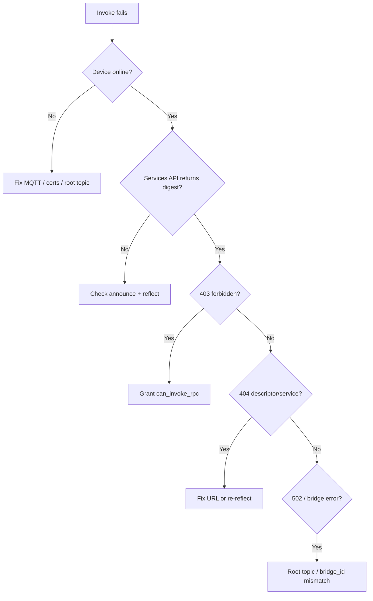

Structured troubleshooting for Device gRPC RPC. Work top-down: device online → schema bound → permissions → invoke URL.

## Quick diagnostic tree



## Symptom index

| Symptom | Likely cause | Section |
|---------|--------------|---------|
| Empty `services` from GET `/rpc/services` | Schema not bound | [Schema not bound](#schema-not-bound) |
| `device descriptor not found` on invoke | No binding in Postgres | [Schema not bound](#schema-not-bound) |
| `forbidden` (403) | Missing ReBAC permission | [Permissions](#permissions) |
| `unauthorized` (401) | Invalid or missing token | [Authentication](#authentication) |
| `no active rpc bridge` / 502 | Device offline or announce missing | [Bridge not registered](#bridge-not-registered) |
| `service not found in descriptor` | Wrong service name in URL | [Wrong invoke URL](#wrong-invoke-url) |
| `streaming rpc not supported` (501) | Called streaming method | [Streaming limit](#streaming-limit) |
| Invoke works on device, fails from cloud | Root topic mismatch | [Root topic mismatch](#root-topic-mismatch) |
| Stale methods after OTA | Old digest still bound | [Stale schema](#stale-schema-after-ota) |
| Announce published, nothing happens | Worker / topology issue | [Platform topology](#platform-topology) |

---

## Schema not bound

**Symptoms:**

- `GET .../rpc/services` returns `"services": []` with no `descriptor_digest`
- Invoke returns `404` with `"device descriptor not found"`

**Check:**

1. **Device running `device-grpc`** — module in `modules.required` and `security.capabilities`.
2. **MQTT connected** — heartbeat/status shows online in console.
3. **Announce published** — subscribe to `{rootTopic}/register/bridge` or check device logs for schema announce on connect/reconnect.
4. **Payload valid** — must include `action: rpc_schema_announce`, `bridge_id`, `descriptor_digest`, `bridge_type: grpc`.

**Fix:**

```bash
# Force reflection (device must be online)
curl -sS -X POST \
  -H "Authorization: Bearer $TOKEN" \
  -H "ORG-ID: $ORG_ID" \
  -H "Content-Type: application/json" \
  -d '{}' \
  "https://api.ilyama.golain.io/core/api/v1/projects/$PROJECT_ID/devices/$DEVICE_ID/rpc/reflect"
```

Requires `can_write_device_metadata`. Re-check `/rpc/services` for non-empty `services`.

---

## Bridge not registered

**Symptoms:**

- Schema bound but invoke returns `502`, `503`, or broker errors mentioning **no active rpc bridge**
- Reflect succeeds but invoke times out

**Check:**

1. Device still **online** on MQTT (bridge registration updates `last_seen_at` on announce).
2. **`bridge_id` in announce** matches what the device listener uses.
3. mqtt-bridge listener started — Omega logs `gRPC echo server listening over mqtt-bridge` (or your custom service equivalent).
4. Non-MQTT transport (`memory`) skips the listener — invoke will not work; only announce runs.

**Fix:**

- Restart device with MQTT transport and `device-grpc` module.
- Republish announce (reconnect MQTT or restart Omega).
- Verify broker ingests `{rootTopic}/register/bridge` (no ACL denial).

---

## Root topic mismatch

**Symptoms:**

- Device connected; announce processed; reflect succeeds; invoke fails with dial/bridge errors
- Works with standalone `device-grpc-run` locally but not when registered in Golain

**Cause:**

The cloud dials mqtt-bridge using platform DB fields: `topic_slug` + `device_name` (see [How it works](/edge/device-rpc/how-it-works#root-topic-resolution)). Omega `connection.root_topic` must match.

**Check:**

| Platform | Omega must use |
|----------|----------------|
| `topic_slug=acme`, device name `sensor-01` | `root_topic: acme/sensor-01` or `/acme/sensor-01` |
| No topic slug, device name `sensor-01` | `root_topic: sensor-01` |

Use `golain omega scaffold` or console device MQTT details to confirm the expected root topic.

**Fix:**

Update Omega client YAML / env (`OMEGA_ROOT_TOPIC`) to match platform assignment. Redeploy and verify announce on the corrected topic tree.

---

## Wrong invoke URL

**Symptoms:**

- `404 service not found in descriptor`
- `404 method not found in descriptor`

**Fix:**

1. Call `GET .../rpc/services` and copy the exact `services[].name` and `methods[].name`.
2. Use the **full** service name (e.g. `golain.device.v1.EchoService`), not a short alias.
3. POST to port **8082**:

   ```
   POST :8082/projects/{pid}/devices/{did}/golain.device.v1.EchoService/Echo
   ```

---

## Permissions

**Symptoms:** HTTP `403` with `"message": "forbidden"`

**Fix:**

Grant **`can_invoke_rpc`** on the target device for the calling user or their permission group. Reflect additionally requires **`can_write_device_metadata`**.

Verify in console device permissions or ReBAC tooling, then retry invoke.

---

## Authentication

**Symptoms:** HTTP `401` with `"message": "unauthorized"`

**Check:**

- `Authorization: Bearer` header present and token not expired
- `ORG-ID` header set to a valid organization UUID
- Token is a **user** OIDC token — not a device MQTT credential

---

## Streaming limit

**Symptoms:** HTTP `501` with `"streaming rpc not supported"`

**Cause:** Cloud invoke proxy supports **unary** methods only.

**Fix:** Call a unary method (e.g. `Echo`, not `EchoServerStream`). Streaming remains available device-side over mqtt-bridge for custom tooling.

---

## Stale schema after OTA

**Symptoms:**

- New firmware deployed; invoke hits old methods or fails with schema errors
- `/rpc/services` shows outdated method list

**Check:**

1. Device logs show new `descriptor_digest` in announce after OTA restart.
2. Digest in announce differs from `GET /rpc/services` response.

**Fix:**

1. Restart device so announce runs with updated embedded descriptor.
2. If announce digest is correct but platform stale, `POST .../rpc/reflect`.
3. After proto breaking changes, verify compat policy for your rollout (descriptor registry is content-addressed — new digest = new registry entry).

---

## Platform topology

**Symptoms:**

- Announce visible on MQTT but `/rpc/services` never populates
- Reflect hangs or returns worker errors
- Invoke never reaches mqtt-broker

**Check after RPC feature upgrade:**

1. **RPC domain worker running** — domain-workers logs show RPC worker registered.
2. **RabbitMQ topology** — run `make rabbitmq-topology` in ilyama. Queues must include:
   - `device_rpc_schema_announced_queue`
   - `device_bridge_invoke_queue`
   - `device_bridge_reflect_queue`
3. **mqtt-broker version** — must include RPC bridge hook and invoke/reflect handlers.
4. **apis rpcproxy** — apis logs `rpc proxy listening addr :8082`.

**Symptoms of stale topology:**

- MQTT announce succeeds; no worker consume logs
- Invoke returns immediate AMQP/502 errors

---

## Operator checklist

Run these in order when debugging a single device:

```bash
# 1. Device online?
#    Console or: platform-tui devices list

# 2. Schema bound?
curl -sS -H "Authorization: Bearer $TOKEN" -H "ORG-ID: $ORG_ID" \
  "$API/core/api/v1/projects/$PROJECT_ID/devices/$DEVICE_ID/rpc/services" | jq .

# 3. Reflect if empty
curl -sS -X POST -H "Authorization: Bearer $TOKEN" -H "ORG-ID: $ORG_ID" \
  -H "Content-Type: application/json" -d '{}' \
  "$API/core/api/v1/projects/$PROJECT_ID/devices/$DEVICE_ID/rpc/reflect" | jq .

# 4. Probe invoke (unary Echo)
curl -sS -X POST \
  "$RPC_PROXY/projects/$PROJECT_ID/devices/$DEVICE_ID/golain.device.v1.EchoService/Echo" \
  -H "Authorization: Bearer $TOKEN" \
  -H "ORG-ID: $ORG_ID" \
  -H "Content-Type: application/json" \
  -H "Connect-Protocol-Version: 1" \
  -d '{"message":"diagnostic ping"}'
```

Set `API` to your main API base and `RPC_PROXY` to `:8082` (e.g. `https://api.ilyama.golain.io:8082`).

---

## Still stuck?

- Device-side setup: [Omega setup](/edge/device-rpc/omega-setup)
- Pipeline detail: [How it works](/edge/device-rpc/how-it-works)
- HTTP caller reference: [Invoking methods](/edge/device-rpc/invoking-methods)
- Module README: [omega/modules/device-grpc](https://github.com/golain-io/omega/blob/main/modules/device-grpc/README.md)

<Note>
  This guide covers **Device gRPC RPC** only. For legacy shell command RPC (`exec:…` over signed control topics), see [Remote control — Legacy shell RPC](/edge/remote-control#legacy-shell-rpc).
</Note>
