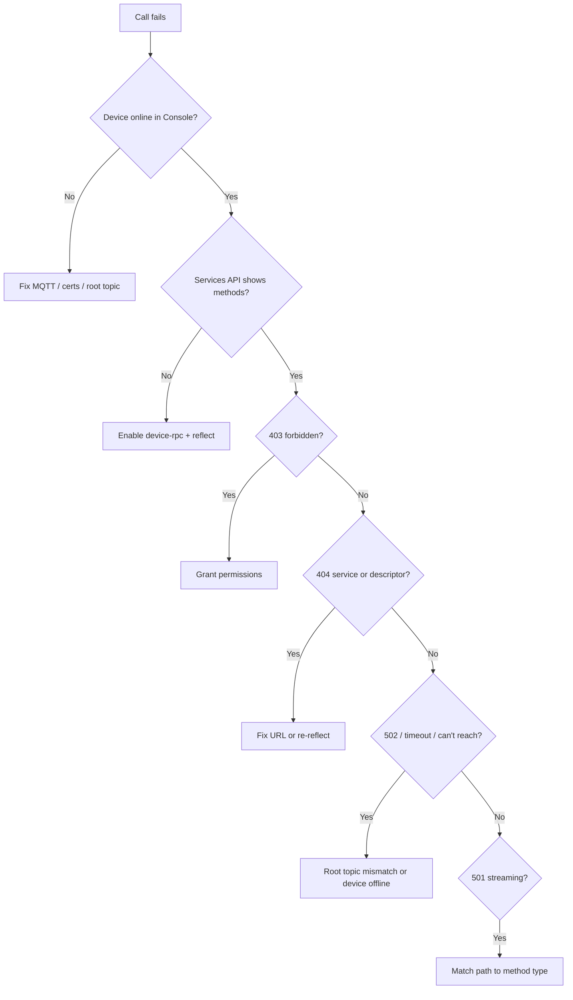

Work top-down when a call fails: device online → schema bound → permissions → correct URL → invoke.

Set these for the copyable commands:

```bash
export API=https://api.ilyama.golain.io/core/api/v1
export RPC_PROXY=https://rpc.ilyama.golain.io
export TOKEN=…
export ORG_ID=…
export PROJECT_ID=…
export DEVICE_ID=…
```

## Quick diagnostic flow



## Symptom index

| Symptom | Likely cause | Section |
|---------|--------------|---------|
| Empty `services` from list services | Schema not bound | [Schema not bound](#schema-not-bound) |
| `device descriptor not found` on invoke | Schema not bound | [Schema not bound](#schema-not-bound) |
| `forbidden` (403) | Missing permission | [Permissions](#permissions) |
| `unauthorized` (401) | Invalid or missing token | [Permissions](#permissions) |
| 502 / timeout / can't reach device | Device offline or wrong root topic | [Device offline](#device-offline--cant-reach-device) |
| `service not found in descriptor` | Wrong service name in URL | [Wrong URL](#wrong-url) |
| `method not found in descriptor` | Wrong method name in URL | [Wrong URL](#wrong-url) |
| `streaming rpc not supported` (501) | Server-stream or client/bidi on sync path | [Streaming on wrong path](#streaming-on-wrong-path) |
| `only server-streaming rpc supported` (501) | Unary or client/bidi on `/streams/` path | [Streaming on wrong path](#streaming-on-wrong-path) |
| Invoke works locally, fails from cloud | Root topic mismatch | [Root topic mismatch](#root-topic-mismatch) |
| Outdated method list after OTA | Stale schema binding | [Stale schema after OTA](#stale-schema-after-ota) |
| Queued call stuck or expired | Device offline past TTL | [Queued stuck or duplicates](#queued-stuck-or-duplicates) |
| Duplicate side effects from queued RPC | Handler not idempotent | [Queued idempotency](#queued-idempotency) |
| `invalid json request body` (400) on stream | Wrong `Content-Type` or malformed JSON for stream open | [Content-Type and transcoding](#content-type-and-transcoding) |
| `unsupported content type` (415) on stream | Connect binary or gRPC-Web on `/streams/` path | [Content-Type and transcoding](#content-type-and-transcoding) |
| Schema never appears after device connects | Self-hosted stack misconfiguration | [Self-hosted operators](#self-hosted-operators) |

---

## Schema not bound

**Symptoms:**

- `GET …/rpc/services` returns `"services": []` with no `descriptor_digest`
- Invoke returns `404` with `"device descriptor not found"`

**Check:**

1. **`device-rpc` module enabled** — in `modules.required` and `security.capabilities`. See [Omega setup](/edge/device-rpc/omega-setup).
2. **Device online** — Console shows the device connected over MQTT.
3. **Device restarted after enabling RPC** — the module publishes a schema announce on start and reconnect.

**Fix:**

```bash
# List services (should show descriptor_digest + services when bound)
curl -sS \
  -H "Authorization: Bearer $TOKEN" \
  -H "ORG-ID: $ORG_ID" \
  "$API/projects/$PROJECT_ID/devices/$DEVICE_ID/rpc/services"

# Force reflection (device must be online; requires can_write_device_metadata)
curl -sS -X POST \
  -H "Authorization: Bearer $TOKEN" \
  -H "ORG-ID: $ORG_ID" \
  -H "Content-Type: application/json" \
  -d '{}' \
  "$API/projects/$PROJECT_ID/devices/$DEVICE_ID/rpc/reflect"
```

Re-run list services. You should see a non-empty `services` array before invoking.

---

## Device offline / can't reach device

**Symptoms:**

- Schema is bound but invoke returns **502**, **503**, or times out
- Reflect succeeds but invoke never completes
- Error text mentions the device cannot be reached

**Check:**

1. **Device online** in Console — MQTT heartbeat recent.
2. **`device-rpc` running** — Omega logs show the gRPC listener started (not `memory` transport only).
3. **MQTT credentials and TLS** — cert not expired; broker reachable from the device network.

**Fix:**

- Restart the device with MQTT transport and `device-rpc` enabled.
- Reconnect MQTT (restart Omega or power-cycle) so the platform sees the device again.
- Probe with a unary Echo call:

```bash
curl -sS -X POST \
  "$RPC_PROXY/projects/$PROJECT_ID/devices/$DEVICE_ID/golain.device.v1.EchoService/Echo" \
  -H "Authorization: Bearer $TOKEN" \
  -H "ORG-ID: $ORG_ID" \
  -H "Content-Type: application/json" \
  -d '{"message":"diagnostic ping"}'
```

If list services works but invoke still fails, check [Root topic mismatch](#root-topic-mismatch).

---

## Root topic mismatch

**Symptoms:**

- Device shows online; schema bound; invoke still fails with reachability or bridge errors
- Works with a local standalone echo server but not when registered in Golain

**Cause:**

The cloud dials your device using the **topic slug** and **device name** from the Console. Omega `connection.root_topic` must match that assignment.

**Check:**

| Console assignment | Omega `root_topic` |
|--------------------|--------------------|
| Topic slug `acme`, device name `sensor-01` | `acme/sensor-01` or `/acme/sensor-01` |
| No topic slug, device name `sensor-01` | `sensor-01` |

Confirm in Console device MQTT details or with `golain omega scaffold`.

**Fix:**

Update Omega client YAML or `OMEGA_ROOT_TOPIC`, redeploy, and verify list services still returns methods. Then retry invoke.

---

## Permissions

**Symptoms:**

- HTTP **403** with `"message": "forbidden"`
- HTTP **401** with `"message": "unauthorized"`

**Check:**

- `Authorization: Bearer` header present and token not expired
- `ORG-ID` set to a valid organization UUID
- Token is a **user** OIDC token — not a device MQTT credential

**Fix:**

Grant **`can_invoke_rpc`** to call methods (implies **`can_read_rpc`** for listing services, queued polls, and invocation history). Grant **`can_read_rpc`** alone for read-only access. Reflect additionally requires **`can_write_device_metadata`**.

Update permissions in Console, then retry.

---

## Wrong URL

**Symptoms:**

- `404 service not found in descriptor`
- `404 method not found in descriptor`
- Invoke hits the management API host instead of the **RPC host**

**Fix:**

1. List services and copy exact `services[].name` and `methods[].name`:

```bash
curl -sS \
  -H "Authorization: Bearer $TOKEN" \
  -H "ORG-ID: $ORG_ID" \
  "$API/projects/$PROJECT_ID/devices/$DEVICE_ID/rpc/services"
```

2. Use the **full** service name (for example `golain.device.v1.EchoService`), not a short alias.
3. POST to the **RPC host** with no `/core/api/v1` prefix:

```
POST https://rpc.ilyama.golain.io/projects/{project_id}/devices/{device_id}/golain.device.v1.EchoService/Echo
```

Only **unary** methods use the sync path. **Server-stream** methods use `/streams/{Service}/{Method}`. See [Invoking methods](/edge/device-rpc/invoking-methods).

---

## Streaming on wrong path

**Symptoms:**

- HTTP **501** with `"streaming rpc not supported"` — you POSTed a server-stream, client-stream, or bidi method to the **sync** path (`/{Service}/{Method}`)
- HTTP **501** with `"only server-streaming rpc supported"` — you POSTed a unary or non-server-stream method to the **`/streams/`** path

**Fix:**

| Method type | Correct cloud path |
|-------------|-------------------|
| `unary` | `POST $RPC_PROXY/.../{Service}/{Method}` with `Content-Type: application/json` (or generated client encodings) |
| `server_stream` | `POST $RPC_PROXY/.../streams/{Service}/{Method}` with `Accept: text/event-stream` and `curl -N` |
| `client_stream`, `bidi_stream` | Device only — not available from cloud |

Example — move `EchoServerStream` from sync to streams:

```bash
curl -N -X POST \
  "$RPC_PROXY/projects/$PROJECT_ID/devices/$DEVICE_ID/streams/golain.device.v1.EchoService/EchoServerStream" \
  -H "Authorization: Bearer $TOKEN" \
  -H "ORG-ID: $ORG_ID" \
  -H "Content-Type: application/json" \
  -H "Accept: text/event-stream" \
  -d '{"message":"stream me"}'
```

For client-stream and bidi methods (`EchoClientStream`, `EchoBidiStream`), use device-local tooling — the cloud does not expose these shapes.

---

## Content-Type and transcoding

**Symptoms:**

- HTTP **400** with `"invalid json request body"` when opening a server stream with `Content-Type: application/json`
- HTTP **415** with `"unsupported content type"` on the `/streams/` path
- Unary invoke with `application/x-protobuf` returns wire bytes instead of JSON — caller expected Connect JSON

**Cause:**

The RPC proxy transcodes request bodies by path and `Content-Type`. Server streams accept **`application/json`** (transcoded to wire), **`application/proto`**, or **`application/x-protobuf`** (passthrough). Connect binary framing (`application/proto`) is **not** supported on the stream path — use JSON or raw wire.

Unary sync invoke returns Connect JSON only when you send `application/json` (or empty `Content-Type`). `application/x-protobuf` uses the fast wire path and responds with `application/proto`.

**Fix:**

| Goal | Path | `Content-Type` | Body |
|------|------|----------------|------|
| Curl unary Echo | `/{Service}/{Method}` | `application/json` | `{"message":"…"}` |
| Curl server stream | `/streams/{Service}/{Method}` | `application/json` | `{"message":"…"}` |
| Generated client, raw wire | either path (stream: wire only) | `application/x-protobuf` | protobuf-encoded request |
| Generated Connect client (unary) | `/{Service}/{Method}` | `application/proto` | Connect binary framing |

`Connect-Protocol-Version: 1` is optional for JSON unary — the proxy injects it when absent.

Match field names and types to the protobuf request message. A typo or wrong type in JSON fails protojson unmarshaling on the stream path with **400** `invalid json request body`.

→ Full matrix: [Invoking methods — Content-Type matrix](/edge/device-rpc/invoking-methods#content-type-matrix)

---

## Stale schema after OTA

**Symptoms:**

- New firmware deployed; invoke hits old methods or schema errors
- List services shows an outdated method list

**Check:**

1. Device restarted after OTA so it publishes a fresh schema announce.
2. `descriptor_digest` from list services matches what the device logs after restart.

**Fix:**

```bash
curl -sS -X POST \
  -H "Authorization: Bearer $TOKEN" \
  -H "ORG-ID: $ORG_ID" \
  -H "Content-Type: application/json" \
  -d '{}' \
  "$API/projects/$PROJECT_ID/devices/$DEVICE_ID/rpc/reflect"
```

Re-check list services. After breaking proto changes, expect a new digest — plan OTA rollouts so old and new firmware can coexist during migration.

---

## Queued stuck or duplicates

**Symptoms:**

- Poll shows `pending` or `failed` for a long time
- Call becomes `expired` — device was offline past `expires_at`
- Call shows `succeeded` but the device ran the handler twice

**Check:**

1. Device **online** when the platform attempts delivery (queued calls retry on reconnect).
2. **`expires_at`** not passed — default TTL is **900 s**; extend with `?ttl_seconds=` on enqueue (max **86400**).
3. **`attempts`** and **`last_error`** on the poll response.

**Fix — poll status:**

```bash
curl -sS \
  -H "Authorization: Bearer $TOKEN" \
  -H "ORG-ID: $ORG_ID" \
  "$API/projects/$PROJECT_ID/devices/$DEVICE_ID/rpc/queued/$CALL_ID"
```

Bring the device online and wait for delivery. For long outages, enqueue again with a higher `ttl_seconds`.

**Fix — enqueue with longer TTL:**

```bash
curl -sS -X POST \
  "$RPC_PROXY/projects/$PROJECT_ID/devices/$DEVICE_ID/enqueue/golain.device.v1.EchoService/Echo?ttl_seconds=3600" \
  -H "Authorization: Bearer $TOKEN" \
  -H "ORG-ID: $ORG_ID" \
  -H "Content-Type: application/json" \
  -H "Idempotency-Key: $(uuidgen)" \
  -d '{"message":"retry when online"}'
```

→ Full behavior: [Queued invoke](/edge/device-rpc/queued-invoke)

---

## Queued idempotency

**Symptoms:**

- Motor started twice, counter incremented twice, or duplicate writes after one enqueue
- `succeeded` in poll but duplicate real-world effects

**Cause:**

Queued RPC is **at-least-once**. The platform may invoke your device more than once for the same logical call.

**Fix (device firmware):**

1. Add an **idempotency key** field to request protos; cache results per key on the device.
2. Prefer **naturally idempotent** handlers where possible.
3. Do not rely on `call_id` — it is not sent to the device today.

→ [Omega setup — Idempotency](/edge/device-rpc/omega-setup#idempotency-for-queued-invoke)

---

## Self-hosted operators

If the device connects and publishes data but RPC schema never binds or invoke never reaches devices on a **self-hosted** stack, verify apis, mqtt-broker, and worker processes are running and topology is current. See [Self-hosted deployment](/self-hosted/overview).

---

## Operator checklist

Run in order for a single device:

```bash
# 1. Device online? — Console or: golain devices list

# 2. Schema bound?
curl -sS -H "Authorization: Bearer $TOKEN" -H "ORG-ID: $ORG_ID" \
  "$API/projects/$PROJECT_ID/devices/$DEVICE_ID/rpc/services"

# 3. Reflect if empty (requires can_write_device_metadata)
curl -sS -X POST -H "Authorization: Bearer $TOKEN" -H "ORG-ID: $ORG_ID" \
  -H "Content-Type: application/json" -d '{}' \
  "$API/projects/$PROJECT_ID/devices/$DEVICE_ID/rpc/reflect"

# 4. Probe unary Echo
curl -sS -X POST \
  "$RPC_PROXY/projects/$PROJECT_ID/devices/$DEVICE_ID/golain.device.v1.EchoService/Echo" \
  -H "Authorization: Bearer $TOKEN" \
  -H "ORG-ID: $ORG_ID" \
  -H "Content-Type: application/json" \
  -d '{"message":"diagnostic ping"}'
```

Local dev: set `API=https://localhost:19090/core/api/v1` and `RPC_PROXY=http://localhost:8082`.

## Still stuck?

- [Omega setup](/edge/device-rpc/omega-setup) — enable `device-rpc` on the device
- [Invoking methods](/edge/device-rpc/invoking-methods) — sync invoke, SSE streaming, and error codes
- [API reference](/edge/device-rpc/api-reference) — all endpoints
- [Queued invoke](/edge/device-rpc/queued-invoke) — async delivery

<Note>
  This guide covers **Device RPC** only. For legacy shell command RPC (`exec:…` over signed control topics), see [Remote control — Legacy shell RPC](/edge/remote-control#legacy-shell-rpc).
</Note>
