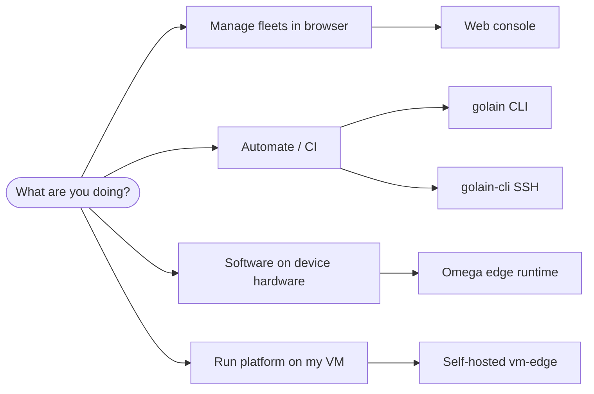

Golain spans a cloud platform, web UI, operator CLIs, and on-device software. Use this page to pick the workflow that matches your role.

## Decision guide



## Web console (`pw`)

**Best for:** fleet managers, support engineers, day-to-day device operations.

- Visual dashboards, OTA wizards, integration setup
- Mock mode for local UI development (`VITE_MOCK_AUTH=true`)
- Requires only a browser and Zitadel login

→ [Console overview](/console/overview) · [Quickstart](/getting-started/quickstart)

## Golain CLI (`golain`)

**Best for:** DevOps, SRE, agents, CI pipelines, power users who want JSON output.

Install from CDN:

```bash
curl -fsSL https://tools.ilyama.golain.io/install.sh | sh
```

- Full CRUD for orgs, projects, fleets, devices, tags, OTA, integrations
- Interactive **TUI** when run without subcommands
- **`golain omega scaffold`** and TUI **Deploy Omega** wizard for edge SQLite sync
- Device authorization login; profiles for staging vs production

→ [Golain CLI overview](/tools/platform-tui/overview)

## Device SSH CLI (`golain-cli`)

**Best for:** operators who need **SSH into devices** through the MQTT bridge.

- Separate tool from **golain** (platform CLI/TUI)
- `golain login` → `golain set` → `golain devices` → `golain ssh <name>`
- Focused command set; production endpoints baked in

→ [Device SSH CLI overview](/tools/golain-cli/overview)

## Omega edge runtime

**Best for:** firmware and edge engineers shipping software onto Linux, macOS, or Windows hardware.

Install from CDN:

```bash
curl -fsSL https://tools.ilyama.golain.io/omega/install.sh | sh
```

- Profile-driven YAML (`clients/*.yaml`) or scaffold-generated config
- Modules: shadow, OTA, heartbeat, RPC, SQLite replication, robotics, etc.
- [JITR](/edge/jitr) for certificate-based enrollment against ilyama

→ [Edge overview](/edge/overview) · [Omega deploy](/tools/platform-tui/omega-deploy)

## Self-hosted operator

**Best for:** running the full ilyama stack on your own VM with TLS, internal PKI, and Zitadel.

- **vm-edge** bundle: Traefik, Let's Encrypt (Cloudflare DNS-01), data-plane mTLS
- Distinct from laptop `make dev-infra` (no TLS, local only)

→ [Self-hosted overview](/self-hosted/overview)

## Typical end-to-end flow

1. **Operator** creates org/project/fleet in console or `golain`.
2. **Edge engineer** runs `golain omega scaffold` (or TUI wizard), starts Omega, connects MQTT.
3. **Support** monitors connectivity in console Event Stream or `golain events watch`.
4. **Release engineer** publishes OTA release, creates deployment, triggers rollout.
5. **Field tech** uses **golain-cli** `golain ssh` for interactive shell when RPC/SSH module is enabled on device.

## Local development vs production

| Concern | Local (`ilyama`) | Production / VM |
|---------|------------------|-----------------|
| Infra | `make dev-provision` (Docker) | vm-edge compose stacks |
| Auth | `AUTH_BYPASS` or dev Zitadel | Real Zitadel + TLS |
| Web UI | `npm run dev` + mock server | Built Docker image + nginx |
| Edge | `golain omega scaffold` or Omega + `-client clients/ilyama-edge.yaml` | Client-specific binary + JITR |

→ [Local development](/self-hosted/local-development)
