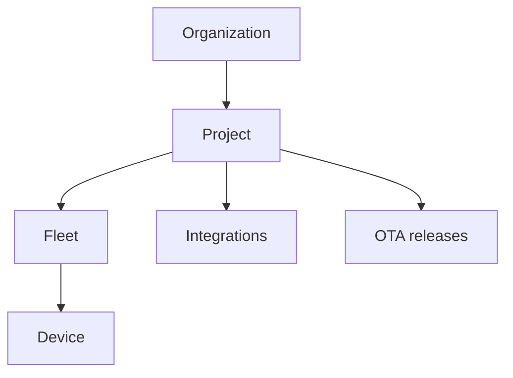

Understanding Golain's resource model helps whether you use the console, CLI, or edge runtime.

## Hierarchy

| Level | Purpose | Examples |
|-------|---------|----------|
| **Organization** | Tenant boundary, members, org settings | `acme-corp` |
| **Project** | Product or environment within the org | `production`, `lab-east` |
| **Fleet** | Device grouping within a project | `eu-gateways`, `floor-3-sensors` |
| **Device** | Single connected endpoint | `sensor-01`, `robot-arm-7` |

Every API call and UI screen is scoped to an **org** and usually a **project**. Fleet and device operations also require a **fleet ID** (or fleet name resolved by CLI tools).

## Authentication

Golain uses **Zitadel** (OIDC) for human users:

- **Web console (`pw`)** — authorization code flow; access token stored in the browser; API requests send `Authorization: Bearer …` and `ORG-ID`.
- **Platform CLI (`platform-tui`)** — OAuth **device authorization** grant (RFC 8628); no client secret; token stored in `~/.config/platform-tui/profiles/`.
- **Golain CLI** — OAuth browser flow against production endpoints (`api.golain.io`, `zitadel.golain.io`).
- **Devices** — MQTT mTLS or username/password plus optional [JITR bootstrap certificates](/edge/jitr); not user OIDC tokens.

<Warning>
  Never put user OIDC tokens on devices. Devices use device credentials or certificates issued during enrollment.
</Warning>

## Device identity and MQTT

Each MQTT device receives:

- A stable **device ID** (UUID)
- **Broker endpoint** (host, port, TLS)
- **Client ID** and credentials or client certificate
- **Topic filters** — allowed publish/subscribe patterns scoped to the device

Edge runtimes like [Omega](/edge/overview) use these values in the `connection:` block of a client YAML profile.

## Tags and targeting

**Tags** are project-scoped labels attached to devices. Use them to:

- Filter device lists in the console and CLI
- Target OTA deployments (`target-tags=prod,eu`)
- Drive automation rules

## OTA model

| Entity | Description |
|--------|-------------|
| **Release** | A firmware or artifact version (name, compatible device types) |
| **Deployment** | A rollout of a release to fleets, tags, or named devices |
| **Trigger** | Starts or resumes delivery to eligible online devices |

Manage releases and deployments from the [console](/console/ota) or [platform-tui](/tools/platform-tui/cli-reference).

## Integrations

External systems (LoRaWAN NS, MDM, webhooks, gateways) connect through **integration accounts** and **bindings** at the project level. The console **Connections** area and `platform-tui integrations` commands list configured providers.

## Edge data sync (advanced)

Devices running Omega with the **SQLite replication** module can mirror local database tables to the cloud over MQTT/QUIC. The platform stages rows, runs schema review, and materializes data into project query surfaces. See [Edge data sync](/edge/data-sync/overview).

## Permissions

Access is **graph-based (ReBAC)**: grants tie users and groups to orgs, projects, fleets, and devices. The console hides actions you cannot perform; API returns `403` when a check fails.

Common roles at org level: **owner**, **admin**, **member**, **viewer**. Finer grants exist at project and fleet scope.

## URLs and environments

| Environment | Typical API | Typical auth |
|-------------|-------------|--------------|
| Golain cloud | `https://api.golain.io` | `https://auth.golain.io` (Zitadel) |
| Self-hosted VM | `https://api.<your-domain>` | `https://auth.<your-domain>` |
| Local dev (ilyama) | `http://localhost:19090` | Dev Zitadel or `AUTH_BYPASS=true` |

CLI tools let you override API and auth endpoints per profile — see [Platform CLI login](/tools/platform-tui/login).
